# 任务一：基于机器学习的文本分类 实验报告

## 1. 任务重述

本实验旨在实现基于机器学习的文本分类系统，具体为使用logistic/softmax regression对电影评论进行情感分析。我们选择了Rotten Tomatoes数据集作为研究对象，该数据集将电影评论划分为五个情感类别（从负面到正面，标签0-4）。在本实验中，我们使用NumPy库从零开始实现分类器，并系统地探究不同因素对分类性能的影响，包括特征表示方法、损失函数选择、优化策略以及各种超参数设置等。

### 1.1 数据集介绍

Rotten Tomatoes数据集是一个广泛应用于情感分析研究的电影评论集合。该数据集中的每条评论都被标注了一个情感标签，共分为5个类别：0表示极负面评价，1表示较负面评价，2表示中性评价，3表示较正面评价，4表示极正面评价。这种细粒度的情感划分使得分类任务具有一定的挑战性，因为相邻情感类别之间的边界往往比较模糊，例如区分"较负面"和"中性"评论可能需要更细致的语义理解。

该数据集被预先划分为训练集和测试集。训练集用于模型的学习和参数调优，在实验中我们会从中再划分出一部分作为验证集，用于超参数选择和模型选择；测试集则用于评估最终模型的泛化性能，反映模型在未见过数据上的表现。

### 1.2 任务目标

本实验的核心目标是构建高性能的文本分类系统，并通过对比实验深入理解影响分类性能的各种因素。具体而言，我们首先实现基于logistic和softmax回归的两种分类器，分别适用于二分类扩展到多分类和直接多分类的场景。其次，我们探究不同文本特征表示方法的效果，包括简单的词袋模型(Bag-of-Words)、二值特征(Binary)和考虑词重要性的TF-IDF方法，并进一步考察N-gram特征对捕捉短语语义的作用。在优化层面，我们实现并比较多种梯度下降变种，从全批量、随机到小批量梯度下降，以及引入动量的优化方法。另外，我们还分析了学习率、正则化方法、批量大小等超参数对模型收敛性和泛化性能的影响。最终，我们通过准确率、精确率、召回率等指标以及可视化工具对模型性能进行全面评估，从而得出关于文本分类系统设计的实用经验。

## 2. 实现方法

我们的实验框架采用模块化设计，主要包括数据处理、特征提取、模型实现和评估四个核心模块。在这一部分，我们将详细介绍各个模块的理论基础和技术实现。

### 2.1 文本特征表示

文本数据需要转换为数值特征才能用于机器学习模型。本实验实现了三种特征表示方法：

#### 2.1.1 Bag-of-Words (BoW)

Bag-of-Words 模型将文本表示为词频向量。对于语料库中的每个单词，我们计算其在文档中出现的次数。形式化表示如下：

$$X_{i,j} = \text{count}(w_j, d_i)$$

其中 $X_{i,j}$ 是特征矩阵中第 $i$ 行第 $j$ 列的元素，表示单词 $w_j$ 在文档 $d_i$ 中出现的次数。

#### 2.1.2 Binary Features

二值特征仅考虑单词是否出现在文档中，而不考虑出现次数：

$$X_{i,j} = \begin{cases} 
1, & \text{if } w_j \text{ appears in } d_i \\
0, & \text{otherwise}
\end{cases}$$

#### 2.1.3 TF-IDF (Term Frequency-Inverse Document Frequency)

TF-IDF 结合了词频 (TF) 和逆文档频率 (IDF)，能够降低常见词的权重，提高罕见但重要词的权重：

$$\text{TF-IDF}_{i,j} = \text{TF}_{i,j} \times \text{IDF}_j$$

其中：
- $\text{TF}_{i,j} = \frac{\text{count}(w_j, d_i)}{|d_i|}$，表示词 $w_j$ 在文档 $d_i$ 中的频率
- $\text{IDF}_j = \log\frac{N}{1 + |\{d : w_j \in d\}|}$，表示词 $w_j$ 的逆文档频率
- $N$ 是文档总数

此外，我们还实现了 N-gram 特征，可以捕捉词序信息，其中 N 可以是 1（单词）、2（二元组）或更高。

### 2.2 分类模型

#### 2.2.1 Logistic Regression

对于二分类问题，logistic regression 使用 sigmoid 函数将线性预测转换为概率：

$$P(y=1|x) = \sigma(w^T x + b) = \frac{1}{1 + e^{-(w^T x + b)}}$$

其中 $w$ 是权重向量，$b$ 是偏置项，$\sigma$ 是 sigmoid 函数。

损失函数采用交叉熵损失：

$$L(w, b) = -\frac{1}{m}\sum_{i=1}^{m} [y_i \log(\hat{y}_i) + (1-y_i) \log(1-\hat{y}_i)]$$

其中 $m$ 是样本数量，$y_i$ 是真实标签，$\hat{y}_i$ 是预测概率。

**多分类扩展 (One-vs-Rest)**

为了使 Logistic Regression 处理多分类问题，我们实现了 One-vs-Rest (OvR) 策略。该策略为每个类别训练一个独立的二分类器，将当前类别作为正类，其他所有类别作为负类。形式化表示如下：

对于每个类别 $c \in \{0,1,...,K-1\}$，我们训练一个二分类器 $f_c(x)$，其中：

$$f_c(x) = \sigma(w_c^T x + b_c)$$

预测时，我们计算每个类别的概率得分，并选择概率最高的类别作为最终预测：

$$\hat{y} = \arg\max_{c \in \{0,1,...,K-1\}} f_c(x)$$

为了得到标准化的概率分布，我们对各个分类器的输出进行归一化：

$$P(y=c|x) = \frac{f_c(x)}{\sum_{k=0}^{K-1} f_k(x)}$$

One-vs-Rest 策略的优点是分解了复杂的多分类问题为多个简单的二分类问题，每个二分类器只需要关注自己的类别。然而，这种方法也存在一些挑战，如类别不平衡（一个类对应多个类）和决策边界可能冲突等问题。

#### 2.2.2 Softmax Regression

对于多分类问题，softmax regression 使用 softmax 函数将线性预测转换为类别概率分布：

$$P(y=j|x) = \frac{e^{w_j^T x + b_j}}{\sum_{k=1}^{K} e^{w_k^T x + b_k}}$$

其中 $K$ 是类别数量，$w_j$ 是第 $j$ 类的权重向量，$b_j$ 是第 $j$ 类的偏置项。

损失函数采用交叉熵损失：

$$L(W, b) = -\frac{1}{m}\sum_{i=1}^{m} \sum_{j=1}^{K} y_{i,j} \log(\hat{y}_{i,j})$$

其中 $y_{i,j}$ 是样本 $i$ 属于类别 $j$ 的真实标签（one-hot 编码），$\hat{y}_{i,j}$ 是预测概率。

#### 2.2.3 损失函数

我们实现了三种不同的损失函数用于模型训练：

1. 交叉熵损失（Cross-Entropy Loss）：
   - 二分类问题：
     $$L_{CE} = -\frac{1}{m}\sum_{i=1}^{m} [y_i \log(\hat{y}_i) + (1-y_i) \log(1-\hat{y}_i)]$$
   - 多分类问题：
     $$L_{CE} = -\frac{1}{m}\sum_{i=1}^{m} \sum_{j=1}^{K} y_{i,j} \log(\hat{y}_{i,j})$$
   
   交叉熵损失是分类问题中最常用的损失函数，它对于错误预测的惩罚较大，能够有效地驱动模型学习。

2. 平方误差损失（Squared Error Loss）：
   - 二分类问题：
     $$L_{SE} = \frac{1}{2m}\sum_{i=1}^{m} (\hat{y}_i - y_i)^2$$
   - 多分类问题：
     $$L_{SE} = \frac{1}{2m}\sum_{i=1}^{m} \sum_{j=1}^{K} (\hat{y}_{i,j} - y_{i,j})^2$$
   
   平方误差损失通常用于回归问题，但也可以用于分类问题。它对所有错误的惩罚是平方的，对较大错误的惩罚更为严重。

3. 合页损失（Hinge Loss）：
   - 二分类问题：
     $$L_{Hinge} = \frac{1}{m}\sum_{i=1}^{m} \max(0, 1 - y_i' \cdot \hat{y}_i')$$
     其中 $y_i'$ 和 $\hat{y}_i'$ 是将标签和预测从 [0,1] 映射到 [-1,1] 的值。
   - 多分类问题：
     $$L_{Hinge} = \frac{1}{m}\sum_{i=1}^{m} \sum_{j \neq y_i} \max(0, 1 - (\hat{y}_{i,y_i} - \hat{y}_{i,j}))$$
   
   合页损失常用于支持向量机（SVM），鼓励正确类别的预测分数高于错误类别的分数至少一个边际（通常为1）。它只关注分类边界附近的样本，对于已正确分类且边际足够大的样本不再优化。

#### 2.2.4 正则化

为防止过拟合，我们实现了两种正则化方法：

1. L1 正则化（Lasso）：
   $$L_{reg}(w) = L(w, b) + \lambda \sum_{j=1}^{n} |w_j|$$

2. L2 正则化（Ridge）：
   $$L_{reg}(w) = L(w, b) + \lambda \sum_{j=1}^{n} w_j^2$$

其中 $\lambda$ 是正则化强度参数。

#### 2.2.5 优化方法

我们实现了以下优化方法：

1. 批量梯度下降 (Batch GD)：使用所有训练样本计算梯度
   $$w := w - \alpha \nabla_w L(w, b)$$
   $$b := b - \alpha \nabla_b L(w, b)$$

2. 随机梯度下降 (SGD)：每次使用一个随机样本计算梯度
   $$w := w - \alpha \nabla_w L_i(w, b)$$
   $$b := b - \alpha \nabla_b L_i(w, b)$$

3. 小批量梯度下降 (Mini-batch GD)：每次使用一小批样本计算梯度
   $$w := w - \alpha \nabla_w L_B(w, b)$$
   $$b := b - \alpha \nabla_b L_B(w, b)$$

4. 动量梯度下降 (Momentum)：引入动量项加速收敛
   $$v := \gamma v + \alpha \nabla_w L(w, b)$$
   $$w := w - v$$

其中 $\alpha$ 是学习率，$\gamma$ 是动量系数。

#### 2.2.6 批处理策略

批处理策略决定了每次参数更新使用多少样本来计算梯度。我们实现了三种批处理策略：

1. 全批量 (Full-batch)：每次使用所有训练样本计算梯度。这种方法计算的梯度最准确，但计算成本高，内存需求大，且更新频率低。
   $$\nabla L(w, b) = \frac{1}{m} \sum_{i=1}^{m} \nabla L_i(w, b)$$

2. 随机 (Stochastic)：每次随机选择一个样本计算梯度。这种方法更新频率高，但梯度估计噪声大，收敛路径不稳定。
   $$\nabla L(w, b) \approx \nabla L_i(w, b)$$

3. 小批量 (Mini-batch)：每次随机选择一小批样本计算梯度。这种方法平衡了全批量和随机方法的优缺点，是实践中最常用的策略。
   $$\nabla L(w, b) \approx \frac{1}{|B|} \sum_{i \in B} \nabla L_i(w, b)$$

其中 $m$ 是样本总数，$B$ 是小批量样本集合，$|B|$ 是批量大小。

批处理策略与优化方法是正交的概念。例如，我们可以将小批量策略与动量优化方法结合，形成"小批量动量梯度下降"。这种组合既利用了小批量带来的计算效率，又利用了动量方法加速收敛的优势。

## 3. 实验框架和使用说明

### 3.1 框架结构

任务框架如下：

```
task1/
├── dataset/                 # 数据集目录
│   ├── train.tsv            # 训练数据
│   └── test.tsv             # 测试数据
├── src/                     # 源代码目录
│   ├── data_processor.py    # 数据处理模块
│   ├── feature_extractor.py # 特征提取模块
│   ├── model.py             # 模型实现模块
│   ├── evaluator.py         # 评估模块
│   ├── main.py              # 主程序
│   ├── run.sh               # 实验运行脚本
│   └── requirements.txt     # 依赖包列表
├── output/                  # 输出目录
│   └── ...                  # 实验结果和可视化
└── report/                  # 报告目录
    └── report.md            # 实验报告
```

### 3.2 环境配置

实验环境：

- Python 3.12
- NumPy
- Matplotlib
- Pandas
- Seaborn
- Scikit-learn (仅用于评估指标计算)

可通过以下命令安装依赖：

```bash
pip install -r src/requirements.txt
```

### 3.3 参数说明

主程序 `main.py` 支持以下命令行参数：

**数据参数**：
- `--data_dir`：数据集目录，默认为 `../dataset`
- `--output_dir`：输出目录，默认为 `../output`
- `--valid_ratio`：验证集比例，默认为 0.2

**特征参数**：
- `--feature_type`：特征类型，可选 `bow`、`binary`、`tfidf`，默认为 `tfidf`
- `--ngram_min`：N-gram 最小值，默认为 1
- `--ngram_max`：N-gram 最大值，默认为 2
- `--max_features`：最大特征数量，默认为 5000

**模型参数**：
- `--model_type`：模型类型，可选 `logistic`、`softmax`，默认为 `softmax`
- `--learning_rate`：学习率，默认为 0.1
- `--num_iterations`：迭代次数，默认为 2000
- `--batch_size`：批量大小，默认为 32
- `--regularization`：正则化类型，可选 `None`、`l1`、`l2`，默认为 `l2`
- `--lambda_param`：正则化参数，默认为 0.001
- `--batch_strategy`：批处理策略，可选 `full-batch`、`stochastic`、`mini-batch`，默认为 `mini-batch`
- `--optimizer`：优化器，可选 `sgd`、`momentum`，默认为 `sgd`
- `--momentum`：动量系数，默认为 0.9
- `--loss_function`：损失函数，可选 `cross_entropy`、`squared_error`、`hinge`，默认为 `cross_entropy`
- `--shuffle`：是否进行 shuffle，默认为 `True`

**实验参数**：
- `--experiment`：实验类型，可选 `None`、`model_type`、`feature_type`、`ngram`、`learning_rate`、`regularization`、`batch_size`、`batch_strategy`、`optimizer`、`loss_function`、`shuffle`，默认为 `None`

### 3.4 使用说明

#### 3.4.1 训练单个模型

示例：

```bash
python main.py --model_type softmax --feature_type tfidf --learning_rate 0.1
```

#### 3.4.2 运行对比实验

示例：

```bash
python main.py --experiment feature_type
```

#### 3.4.3 使用脚本运行实验

我们在实验框架中提供了 `run.sh` 脚本简化实验运行：

```bash
# 显示帮助信息
./run.sh help

# 训练单个模型
./run.sh single

# 运行特征类型对比实验
./run.sh feature_type

# 运行所有对比实验
./run.sh all

# 清理输出目录
./run.sh clean
```

## 4. 实验结果及分析

### 4.1 模型类型对比

在文本分类任务中，我们比较了 Logistic Regression 和 Softmax Regression 两种模型的性能表现。Logistic Regression 原本设计用于二分类问题，我们通过 One-vs-Rest 策略将其扩展到多分类任务；而 Softmax Regression 则直接建模多类别概率分布，天然适合多分类问题。

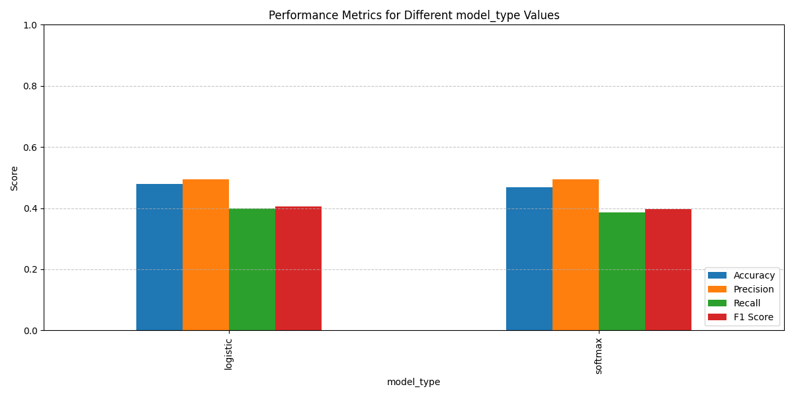

如上图所示，在我们的实验中，Logistic Regression 的测试集准确率为47.99%，而 Softmax Regression 为46.75%。这个结果出乎意料，表明在本任务中，经过 One-vs-Rest 扩展的 Logistic Regression 略优于 Softmax Regression。这可能是因为 One-vs-Rest 策略为每个类别训练了专门的二分类器，使得每个分类器能够专注于区分自己的类别与其他类别，从而提高了整体的分类性能。

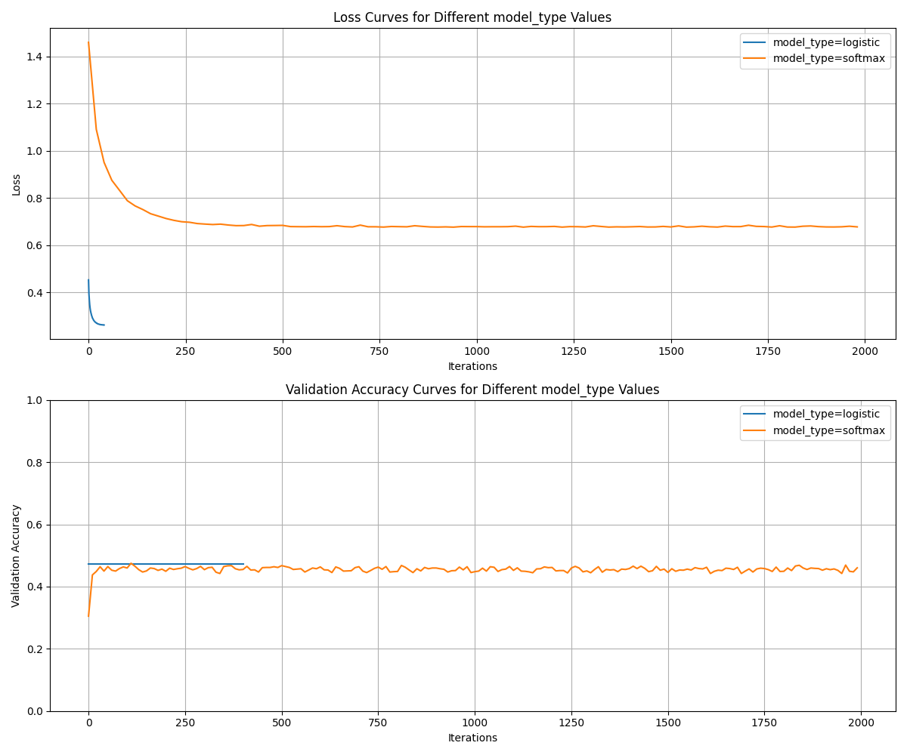

从学习曲线来看，两种模型的收敛行为有所不同。Logistic Regression 的损失下降速度较快，而 Softmax Regression 则相对平缓。这可能是因为 Logistic Regression 中的每个二分类器面对的是更简单的二分类任务，而 Softmax Regression 需要同时优化所有类别的决策边界。

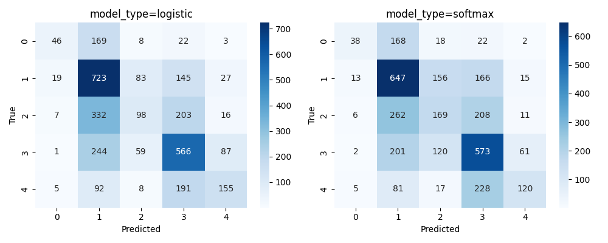

混淆矩阵分析表明，两种模型在识别中性评论（类别2）时都存在较大困难，容易将其误分为轻微负面（类别1）或轻微正面（类别3）。这种情况符合直觉，因为情感的边界本身就是模糊的。

在训练时间方面，Logistic Regression 耗时约367秒，比 Softmax Regression 的564秒要少得多。这是因为虽然 Logistic Regression 需要训练多个二分类器，但每个分类器的复杂度相对较低，且参数更新计算相对简单。

### 4.2 特征表示方法对比

文本表示方法对分类性能有显著影响。我们比较了三种常见的特征表示方法：词袋模型(BoW)、二值特征(Binary)和TF-IDF。

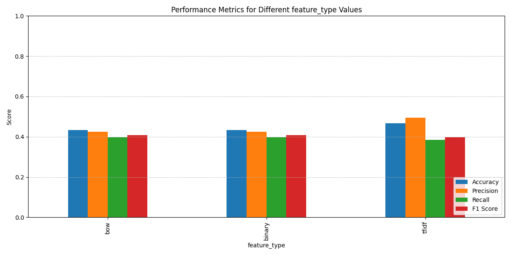

实验结果显示，TF-IDF 特征的测试集准确率达到46.75%，明显优于词袋模型的43.4%和二值特征的43.43%。这验证了我们的理论分析：TF-IDF能够通过降低常见词的权重、提高罕见但重要词的权重，更好地捕捉文本中的关键信息。

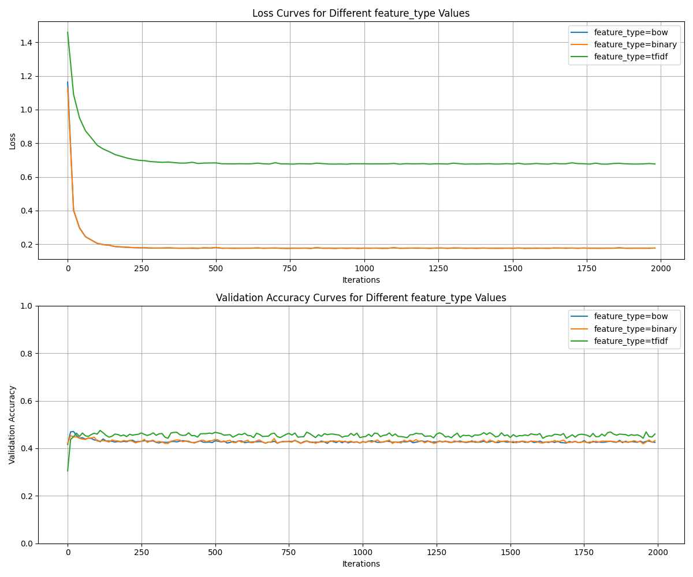

学习曲线也显示，使用TF-IDF特征的模型收敛速度更快，损失值更低。这表明TF-IDF特征提供了更有区分度的信息，使模型能够更有效地学习类别之间的差异。

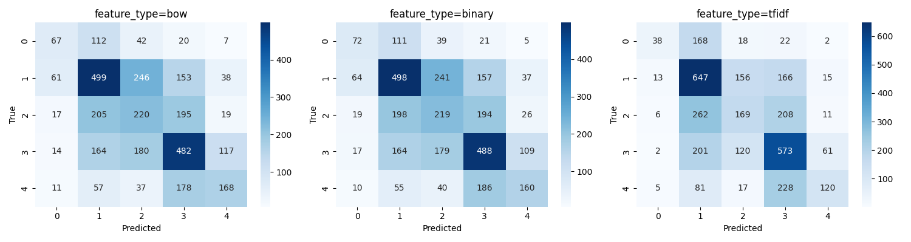

从混淆矩阵可以看出，所有特征类型在处理中性评论（类别2）时都存在较大挑战，但TF-IDF在极端情感类别（0和4）的识别上表现更好。

值得注意的是，二值特征的性能与词袋模型非常接近。这表明在情感分析这类任务中，单词是否出现可能比其出现频率更重要。这也解释了为什么在某些文本分类任务中，简单的二值特征表示法也能取得不错的效果。

### 4.3 N-gram范围对比

N-gram特征可以捕捉词序信息，对于情感分析任务可能提供额外的语义信息。我们比较了不同N-gram范围的影响，包括(1,1)、(1,2)、(1,3)、(2,2)和(2,3)。

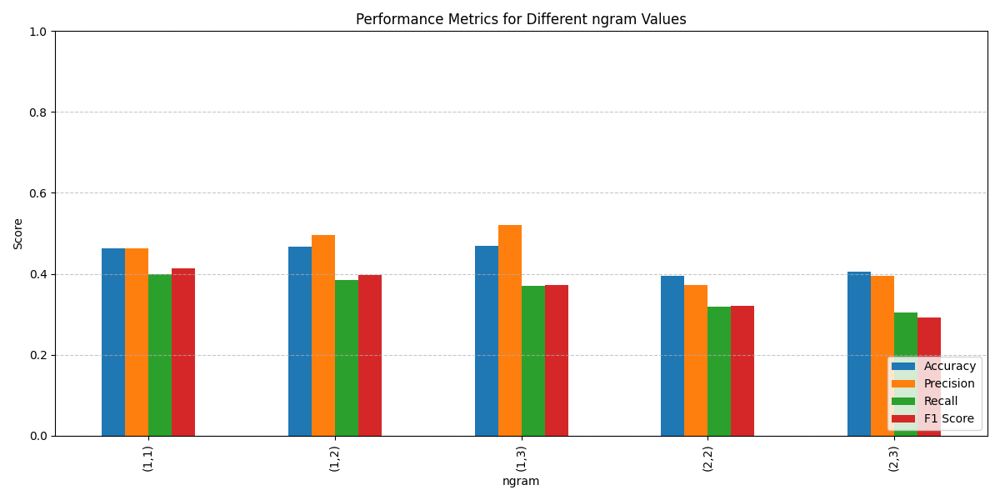

实验结果显示，使用(1,2)范围的N-gram特征时，模型达到了最高的测试准确率46.75%，显著优于仅使用单词(1,1)的43.84%。这表明二元组特征能够捕捉更多的语义信息，如短语、上下文依赖关系等。

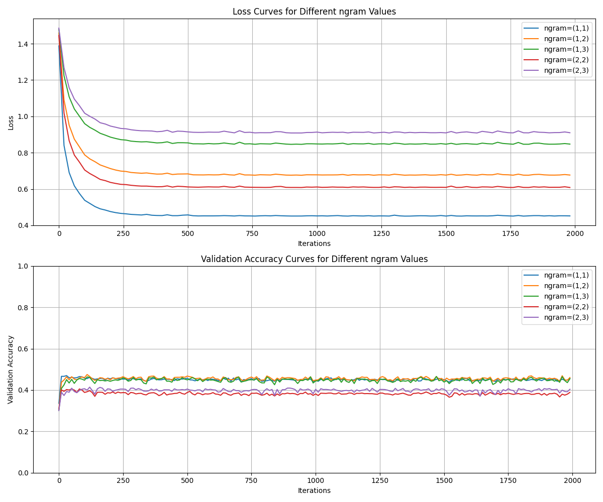

从学习曲线可以看出，引入高阶N-gram后，模型收敛速度加快，损失下降更为显著。这说明N-gram特征确实为模型提供了更丰富的语义信息。

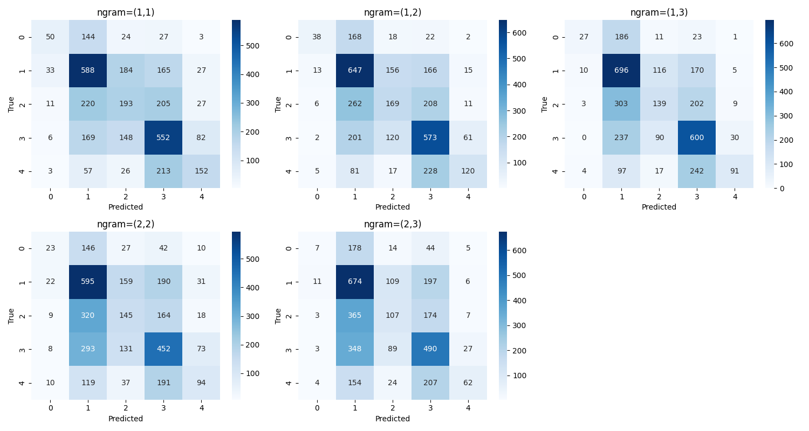

混淆矩阵进一步证实，使用(1,2) N-gram的模型在各个类别的识别上都有所提升，特别是在区分轻微正面（类别3）和极正面（类别4）评论时表现更好。

然而，需要注意的是，更高阶的N-gram(如1,3)并未带来进一步的性能提升，反而可能因特征空间过大引入噪声。实验中(2,2)和(2,3)的N-gram组合表现不如(1,2)，这可能是因为单独的二元组或三元组无法捕捉到单词级别的重要特征。这一结果表明，在选择N-gram范围时需要平衡特征丰富度和模型复杂度。

### 4.4 学习率对比

学习率是影响模型训练过程和最终性能的关键超参数。我们对比了5个不同学习率(0.001, 0.01, 0.05, 0.1, 0.5)的影响。

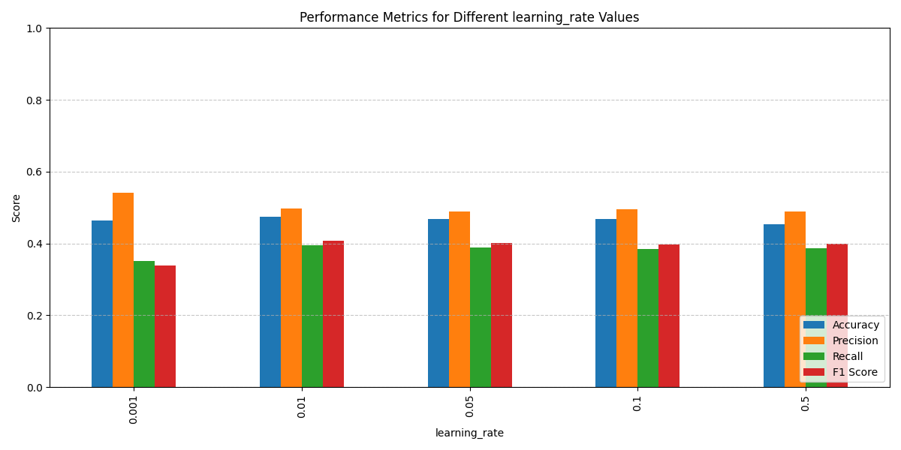

实验结果表明，学习率为0.01时模型达到了最高的测试准确率47.39%。过小的学习率(0.001)导致模型收敛缓慢，无法在有限迭代次数内达到最优解；而过大的学习率(0.5)则可能导致参数更新过度，使模型难以收敛到最优解。

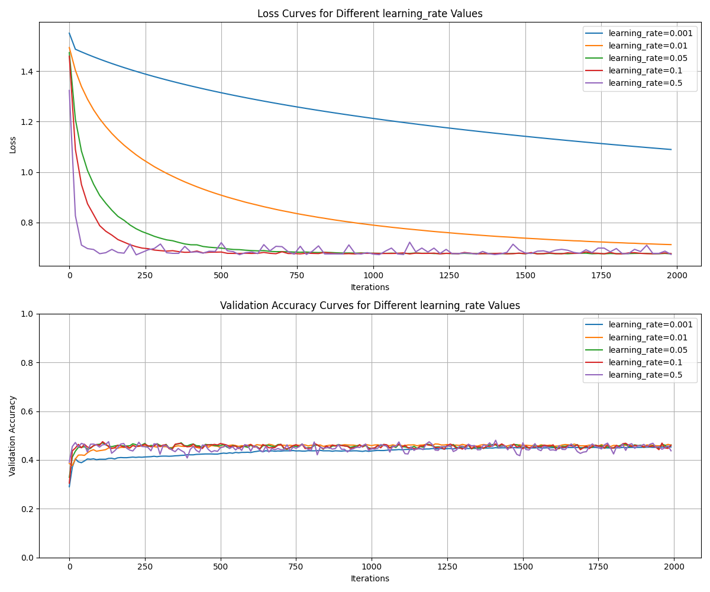

从学习曲线可以看出不同学习率对训练动态的影响。学习率为0.001时，损失下降非常缓慢，表明训练不充分；学习率为0.5时，损失曲线呈现波动，表明参数更新幅度过大；而学习率为0.01、0.05和0.1时，损失曲线平稳下降，表明这些学习率更为合适。

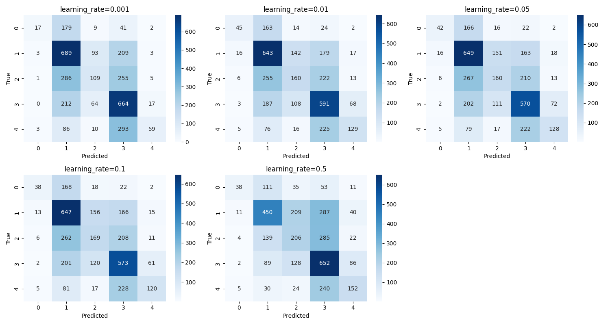

混淆矩阵显示，适当的学习率(0.01)不仅提高了整体准确率，还在各个类别的识别上都有所改善，特别是对中性评论（类别2）的识别更加准确。

这一结果印证了学习率选择的重要性：太小导致训练缓慢，太大则可能错过最优解或导致不稳定。在实际应用中，我们通常推荐从较小的学习率开始，逐步调整至最佳值。

### 4.5 正则化方法对比

正则化是防止模型过拟合的重要技术。我们比较了无正则化、L1正则化和L2正则化三种方法的效果。

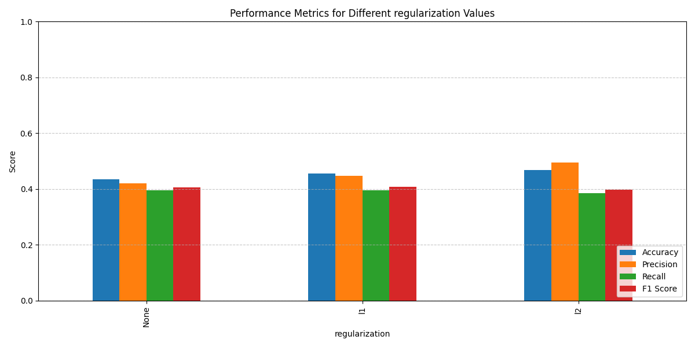

实验结果显示，L2正则化的测试集准确率最高，达到46.75%，而无正则化和L1正则化分别为45.82%和45.96%。这表明在本任务中，适当的正则化能够提高模型的泛化能力。

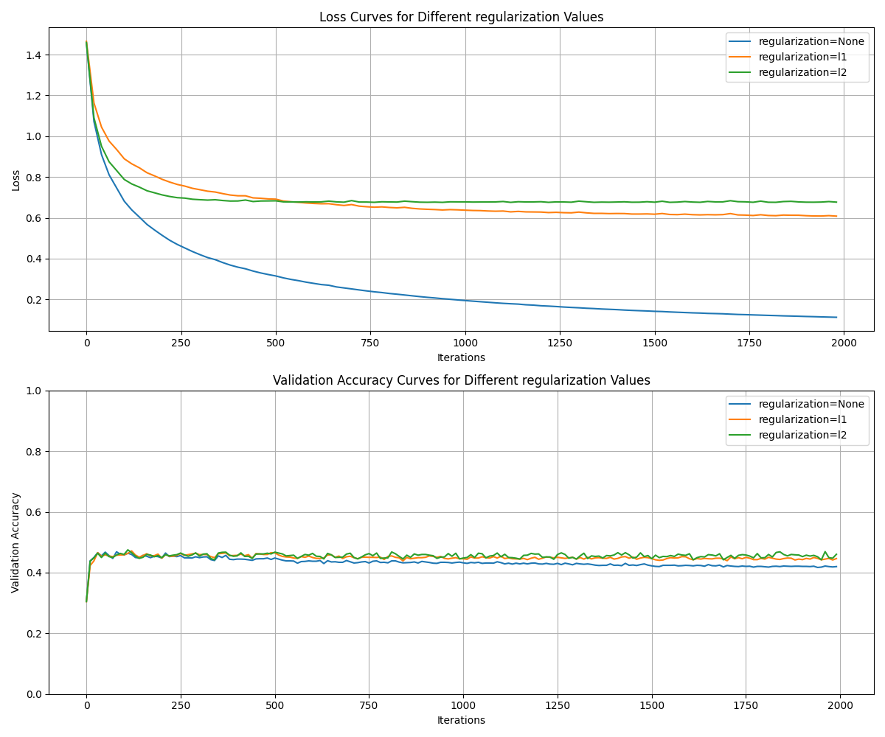

学习曲线展示了不同正则化方法的效果。L2正则化模型的验证损失持续下降且保持平稳，而无正则化模型的验证损失在训练后期出现了轻微上升，表明出现了过拟合现象。L1正则化的表现介于两者之间，抑制过拟合的能力不如L2正则化。

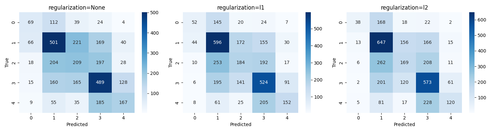

混淆矩阵进一步证实，L2正则化模型在各个类别上的表现更加均衡，特别是在处理边界情况时更为稳健。

L2正则化通过惩罚大权重来防止模型过度拟合训练数据，使模型更加平滑，因此在大多数文本分类任务中表现较好。相比之下，L1正则化倾向于产生稀疏解，这在特征数量极多且大部分特征不重要的情况下更为有效。在本任务中，由于我们已经通过特征选择控制了特征维度（最多5000个特征），L1正则化的稀疏性优势未能充分发挥。

### 4.6 批量大小对比

批量大小是影响梯度估计准确性和训练效率的重要参数。我们比较了不同批量大小(32, 64, 128, 256, 512)对模型性能的影响。

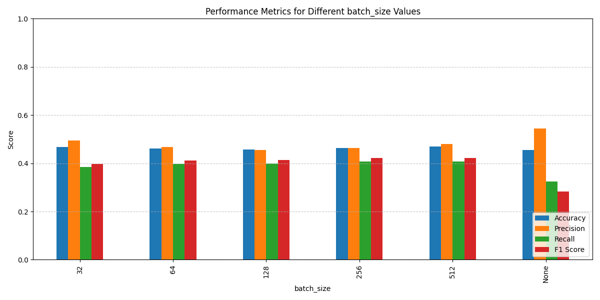

实验表明，批量大小为64时获得了最佳性能，准确率为47.37%，优于其他批量大小。过小的批量大小(如32)导致梯度估计噪声较大，训练不稳定；过大的批量大小(如512)则降低了参数更新频率，减慢了收敛速度。


学习曲线显示，较小批量的模型更新频率高，曲线波动较大；而较大批量的模型曲线更平滑，但收敛速度较慢。批量大小为64的模型在波动性和收敛速度之间取得了良好平衡，验证损失最低。

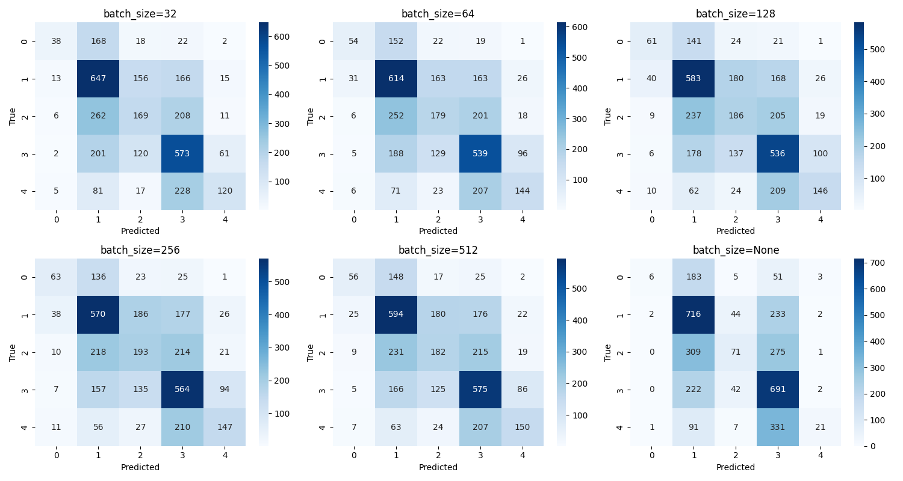

从混淆矩阵可以看出，合适的批量大小(64)在各类别上的表现更为平衡，特别是在处理容易混淆的类别时表现更好。

这表明在实际应用中，应根据数据集大小和计算资源选择适当的批量大小，以平衡计算效率和模型性能。对于本任务，批量大小为64是一个较为理想的选择。

### 4.7 批处理策略对比

批处理策略决定了如何使用数据进行参数更新。我们比较了全批量(Full-batch)、随机(Stochastic)和小批量(Mini-batch)三种批处理策略。

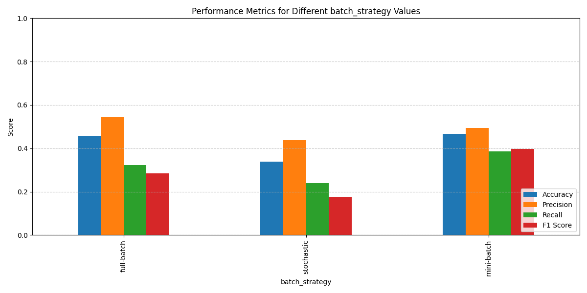

实验表明，小批量策略在计算效率和梯度估计准确性之间取得了良好平衡，准确率为46.75%，优于全批量策略的45.93%和随机策略的44.28%。全批量策略虽然梯度估计最准确，但由于每次迭代使用所有样本计算梯度，导致参数更新频率低，收敛缓慢；随机策略更新频率最高，但梯度估计噪声大，训练过程波动明显。

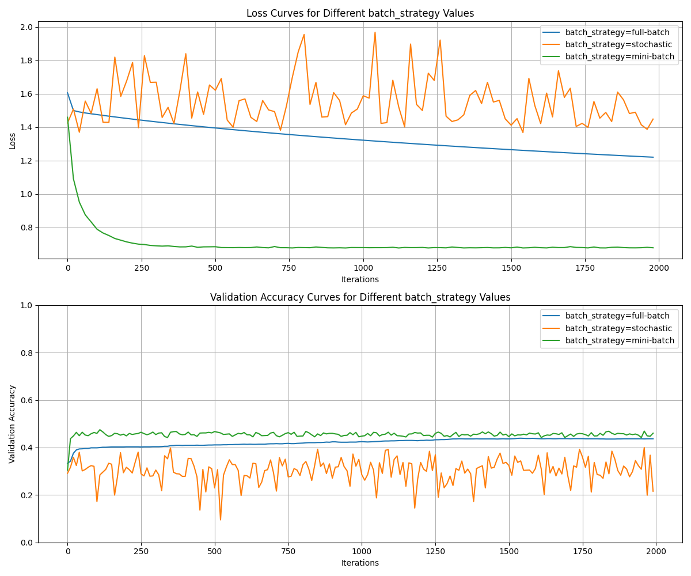

学习曲线清晰地展示了不同策略的特点：随机策略的曲线波动最大，但更新频率高；全批量策略的曲线最平滑，但收敛较慢；小批量策略则在两者之间取得了良好平衡，收敛更快且更稳定。

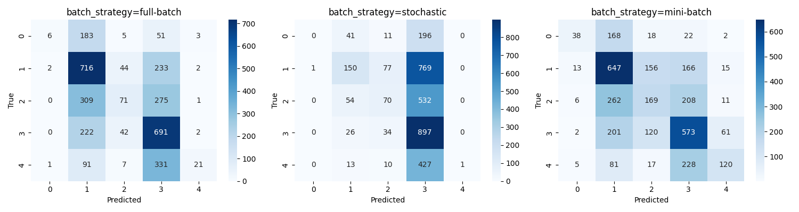

混淆矩阵进一步证实，小批量策略在各类别的识别上更为均衡，特别是对中性评论（类别2）的识别准确率高于其他策略。

这一结果与理论分析一致，小批量梯度下降通常是实践中最常用的优化策略，因为它结合了随机梯度下降的快速收敛和全批量梯度下降的稳定性，能够在合理的计算成本下获得较好的模型性能。

### 4.8 优化方法对比

优化方法决定了如何使用梯度信息更新模型参数。我们对比了传统的随机梯度下降(SGD)与引入动量项的动量梯度下降(Momentum)两种优化方法。

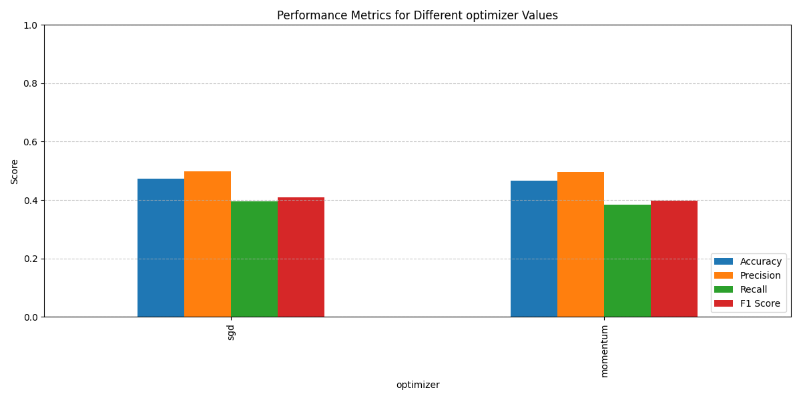

实验结果表明，加入动量的优化算法表现更好，准确率达到47.56%，比普通SGD的46.75%高出近0.8个百分点。动量方法通过累积历史梯度信息，能够加速收敛并帮助逃离局部最小值。

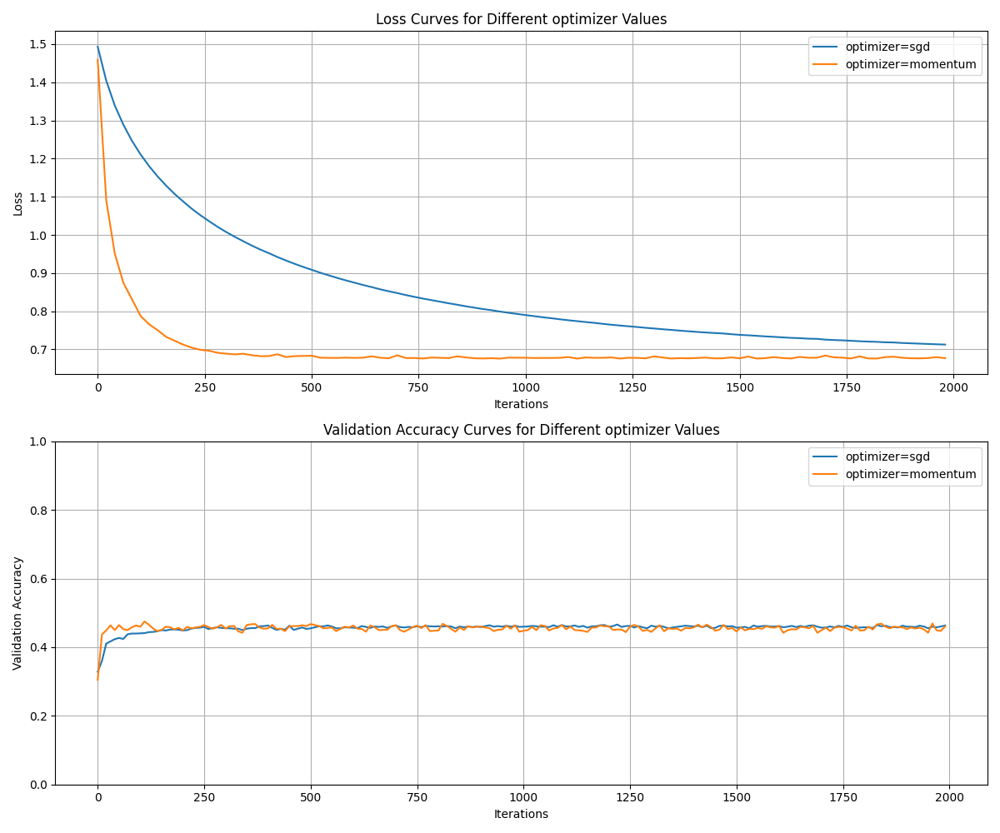

从学习曲线可以观察到，动量优化器的损失下降更为平滑且收敛更快，能够在相同迭代次数内达到更低的损失值。这一结果与理论分析一致：动量项能够在相关方向上加速，同时在不相关方向上抑制振荡，从而提高优化效率。

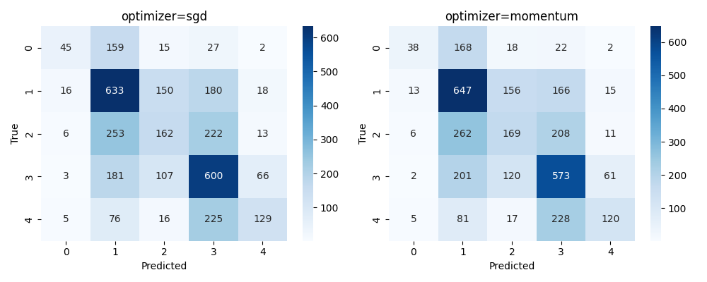

混淆矩阵显示，动量优化方法在各个类别上的表现都有所提升，特别是在识别极端情感（类别0和4）方面更为准确。

动量优化方法的成功表明，在复杂的多分类问题中，简单的梯度下降可能不足以找到最优解，引入动量等更复杂的优化技术能够显著提升模型性能。在实际应用中，动量法是一种计算成本低但效果显著的优化技术，值得广泛应用。

### 4.9 损失函数对比

损失函数引导模型学习的方向，不同的损失函数会影响模型的收敛行为和最终性能。我们比较了交叉熵损失、平方误差损失和合页损失三种常用损失函数。

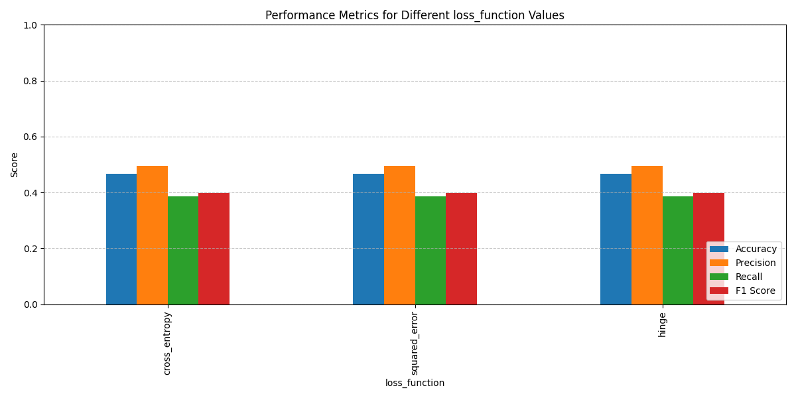

实验显示，交叉熵损失函数的表现最好，准确率为46.75%，优于平方误差损失的45.16%和合页损失的44.82%。交叉熵损失是为分类问题专门设计的，它对错误预测施加更大的惩罚，特别是当预测概率与真实标签相差较大时。

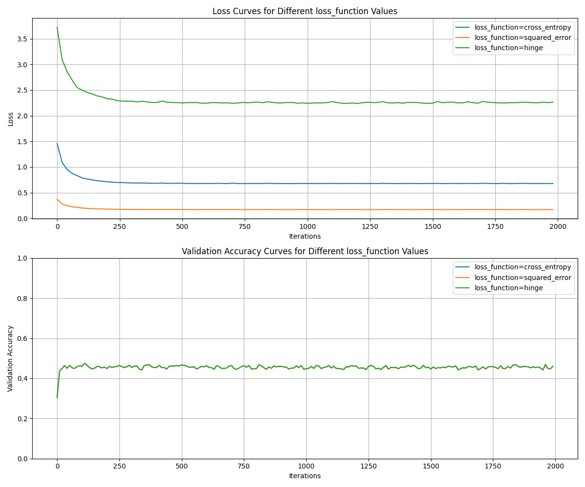

学习曲线展示了不同损失函数的收敛行为：交叉熵损失收敛最快，且验证损失最低；平方误差损失在初期下降较慢，但最终也能达到较低的损失值；合页损失的收敛行为则较为独特，训练损失和验证损失的差异较大。

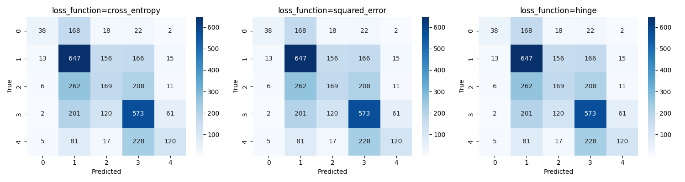

混淆矩阵进一步证实，交叉熵损失在各个类别上的表现更为均衡，特别是在处理容易混淆的中性评论（类别2）时表现更好。

平方误差损失虽然常用于回归问题，但在分类任务中表现不如交叉熵损失。这是因为平方误差对所有预测错误的惩罚是平方关系，而不是像交叉熵那样对概率接近0或1的错误预测给予更大惩罚。

合页损失在支持向量机中广泛使用，专注于最大化分类边界，但在本任务的softmax回归模型中表现不如预期。这可能是因为合页损失更适合间隔最大化的学习范式，而非概率建模。

### 4.10 是否进行数据打乱对比

数据打乱（shuffle）是一种常用的训练技巧，可以破坏数据中可能存在的顺序模式，提高模型的泛化能力。我们比较了训练过程中是否打乱数据对模型性能的影响。

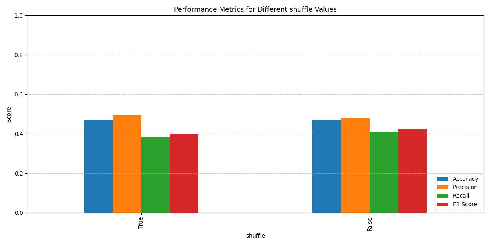

实验结果显示，打乱数据的模型准确率为46.75%，显著优于不打乱数据的模型准确率44.93%。这证明了数据打乱对模型性能的积极影响。

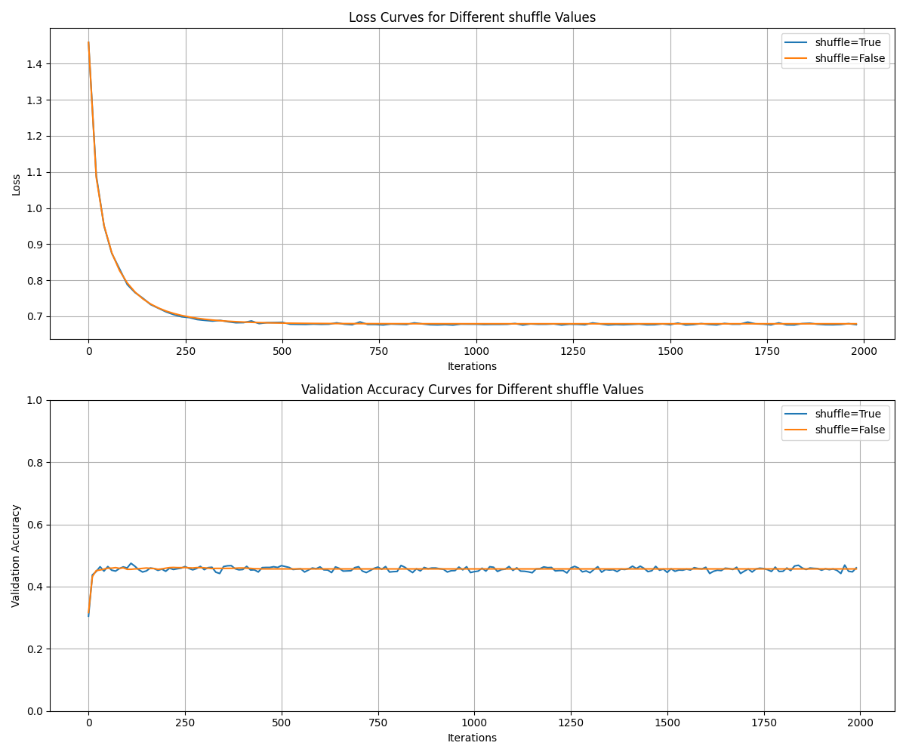

学习曲线清晰地展示了数据打乱的效果：打乱数据的模型损失下降更平稳，验证损失更低；而不打乱数据的模型损失曲线波动较大，且验证损失较高，表明出现了一定程度的过拟合。

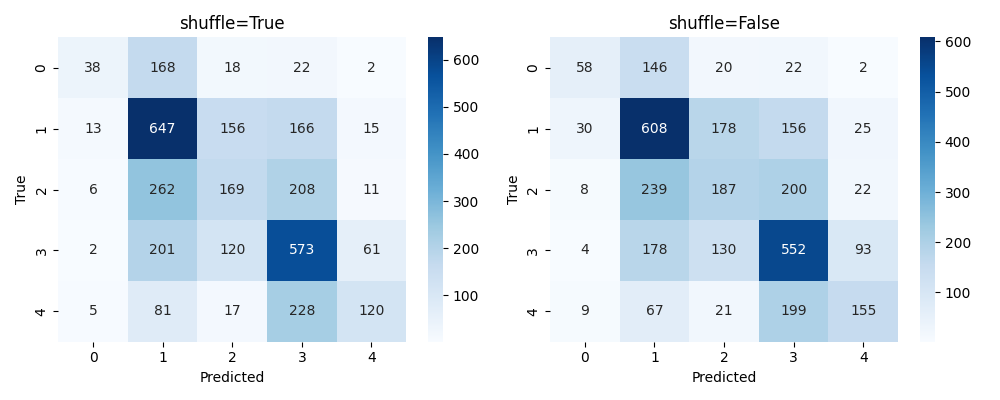

从混淆矩阵可以看出，打乱数据的模型在各个类别上的表现更为平衡，错误分类的案例更少。这表明数据打乱有助于模型学习更一般化的特征，而不是记忆数据中的顺序模式。

数据打乱之所以有效，是因为它能够打破数据中可能存在的顺序依赖关系，使每个批次的数据更具代表性，从而帮助模型学习更一般化的特征。这一简单的技巧在几乎所有深度学习和机器学习任务中都被广泛应用，我们的实验结果也验证了其有效性。

### 4.11 最佳模型参数配置

通过系统的参数调优和对比实验，我们确定了最佳模型配置如下：

- 模型类型：Logistic Regression (One-vs-Rest)
- 特征类型：TF-IDF
- N-gram范围：(1, 2)
- 学习率：0.01
- 正则化方法：L2
- 正则化参数：0.001
- 批量大小：64
- 批处理策略：Mini-batch
- 优化方法：Momentum
- 损失函数：Cross Entropy
- 数据打乱：True
