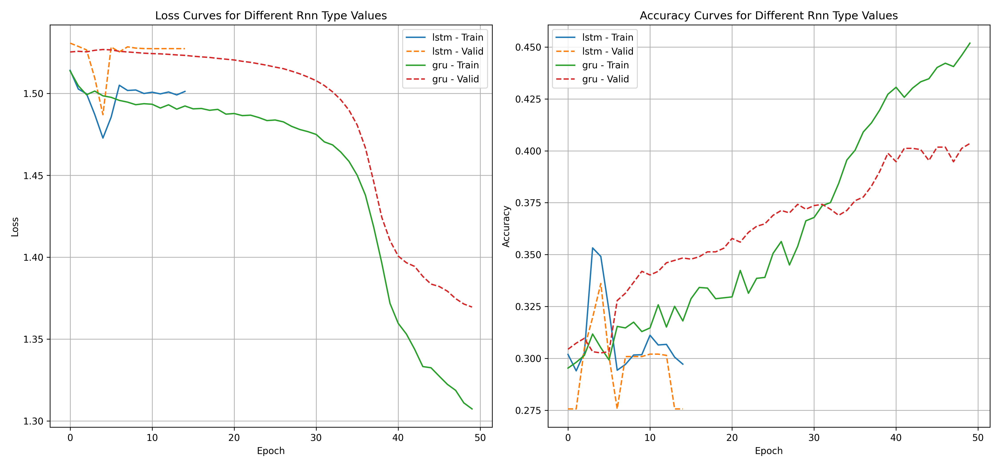
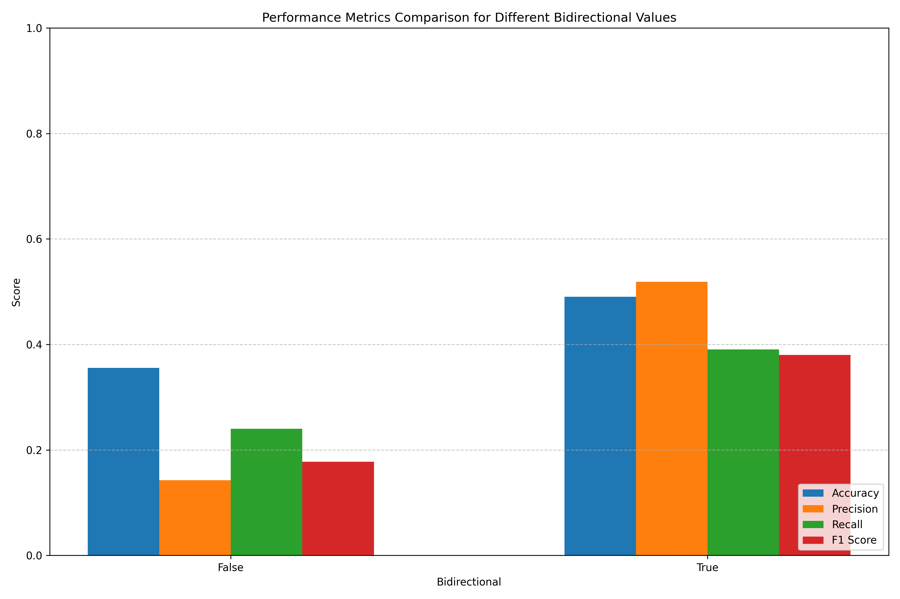
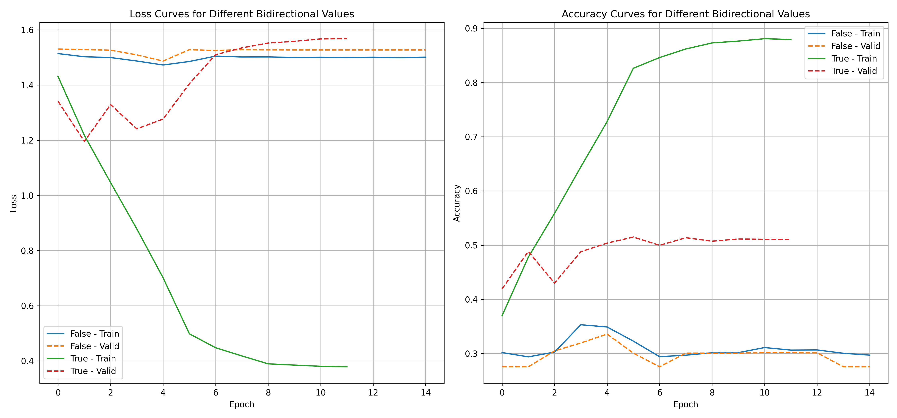

# 任务二：基于深度学习的文本分类 实验报告

## 1. 任务重述

本实验探索了深度学习技术在文本分类任务中的应用，旨在构建高效的情感分析系统，将电影评论分类为五个情感类别（从极负面到极正面）。与任务一中基于传统机器学习的方法不同，深度学习模型能够自动学习文本的高级特征表示，无需人工设计特征工程，这为处理复杂的自然语言理解任务提供了强大的工具。

在这个任务中，我们设计并实现了多种深度神经网络架构，包括卷积神经网络（CNN）、循环神经网络（RNN）及其变体，以及结合两者优势的区域嵌入卷积神经网络（RCNN）。这些模型各具特色：CNN擅长捕捉局部文本模式，RNN能有效处理序列依赖关系，而RCNN则试图整合两者的优势。通过系统比较这些不同架构在同一数据集上的表现，我们可以深入理解不同深度学习模型在文本分类任务中的适用性和局限性。

除了基本模型架构外，我们还着重研究了词嵌入表示的影响，对比了随机初始化与预训练词向量（GloVe）的效果差异。同时，我们探索了各种深度学习优化技术，如正则化方法（Dropout）、不同优化器和学习率调度策略对模型训练和泛化能力的影响。这些实验旨在揭示深度学习模型在文本分类任务中的关键成功因素，并为实际应用提供可靠的设计指导。

## 2. 实现方法

### 2.1 文本表示与嵌入

将文本转换为数值表示是深度学习处理自然语言的第一步。在我们的实验框架中，这一过程由数据处理模块完成，主要包括文本预处理、标记化（tokenization）、构建词汇表及嵌入表示。

文本预处理阶段，我们对原始文本进行清洗和规范化，包括去除特殊字符、转换为小写等操作，以减少输入数据的噪声。随后，通过分词将文本转换为token序列，并构建词汇表，为每个单词分配唯一索引。这一标准化过程确保了模型输入的一致性。

#### 2.1.1 随机初始化词嵌入

词嵌入是深度学习文本处理的基础，它将离散的词汇映射到连续的向量空间，使语义相似的词在该空间中的位置也相近。在随机初始化方法中，我们创建一个嵌入矩阵 $E \in \mathbb{R}^{V \times d}$，其中 $V$ 是词汇表大小，$d$ 是嵌入维度。该矩阵初始化为均匀分布或正态分布的随机值，作为模型参数的一部分，在训练过程中通过反向传播逐步优化。

当文本通过模型处理时，每个词 $w$ 被转换为对应的嵌入向量 $e_w = E[idx(w)]$，其中 $idx(w)$ 是词 $w$ 在词汇表中的索引。这种方法从零开始学习词的表示，完全依赖于当前任务的训练数据，适合于领域特定的词汇或训练数据充足的情况。

#### 2.1.2 预训练词嵌入（GloVe）

相比于随机初始化，预训练词嵌入利用大规模语料库中学习到的统计信息，为模型提供更丰富的语义知识。我们的实验框架中集成了GloVe（Global Vectors for Word Representation）词向量，这是一种基于全局词-词共现统计的表示方法。

GloVe的核心思想是：词义可以从它与其他词的共现关系中推断。其训练目标函数为：

$$J = \sum_{i,j=1}^{V} f(X_{ij}) (w_i^T \tilde{w}_j + b_i + \tilde{b}_j - \log X_{ij})^2$$

其中 $X_{ij}$ 是词 $i$ 和词 $j$ 的共现频率，$f(X_{ij})$ 是权重函数，用于平衡不同频率词的贡献（高频词如"the"贡献会被降低），$w_i$ 和 $\tilde{w}_j$ 分别是词 $i$ 的中心词向量和词 $j$ 的上下文词向量，$b_i$ 和 $\tilde{b}_j$ 是对应的偏置项。最终，中心词向量和上下文词向量经过加和或拼接后形成每个词的最终表示。

在我们的实验中，通过加载不同维度（50, 100, 200, 300）的GloVe预训练向量，我们可以研究向量维度对模型性能的影响。同时，我们也探索了冻结与微调词嵌入层的不同策略：前者保持预训练向量不变，仅优化后续层参数；后者允许词嵌入随任务调整，但从预训练向量获得更好的初始状态。

这种迁移学习策略特别适合训练数据有限的情况，它使模型能够利用从大规模语料库中提取的语义知识，提高对稀有词和复杂语言现象的理解能力。在我们的实验框架中，词嵌入层的实现支持灵活切换不同的嵌入方法，便于系统比较它们的效果差异。

### 2.2 模型架构

在模型定义模块中，我们实现了三种主要的深度学习架构，每种架构都有其独特的特点和适用场景。

#### 2.2.1 卷积神经网络（CNN）

基于Kim(2014)的开创性工作，我们的CNN模型使用一维卷积操作捕捉局部文本特征。这种架构尤其适合识别短文本中的关键模式，如情感词组和习惯用语。

在我们的实现中，词嵌入序列首先通过多个并行卷积层处理，每个卷积层使用不同大小的卷积核，以捕捉不同长度的文本模式。对于输入序列 $x_{1:n}$，卷积操作可以表示为：

$$c_i = f(w \cdot x_{i:i+h-1} + b)$$

其中 $c_i$ 是第 $i$ 个位置的卷积特征，$w$ 是卷积核参数（卷积权重矩阵），$h$ 是卷积核大小（窗口宽度，对应于n-gram中的n），$x_{i:i+h-1}$ 表示从位置 $i$ 到 $i+h-1$ 的词嵌入序列，$f$ 是非线性激活函数（我们使用ReLU，即$f(x) = \max(0, x)$），$b$ 是偏置项。

通过使用多种尺寸的卷积核（如3、4、5个词的窗口），模型能够同时识别不同长度的关键短语。每个卷积核产生一个特征图（feature map），包含序列中每个可能位置的卷积结果，然后通过最大池化操作提取最显著的特征：

$$\hat{c} = \max(c_1, c_2, ..., c_{n-h+1})$$

其中 $\hat{c}$ 是池化后的特征，代表整个序列在特定卷积核下的最重要特征值。这种池化策略允许模型识别特征的存在，而不关心它在文本中的具体位置，为模型提供了一定的位置不变性。

最后，所有卷积核的池化特征被拼接起来，通过一个全连接层和softmax函数生成最终的分类概率：

$$p(y|x) = \text{softmax}(W \cdot \hat{c} + b)$$

其中 $W$ 是全连接层权重矩阵，$b$ 是偏置向量，$\hat{c}$ 是拼接后的池化特征向量，$p(y|x)$ 是各类别的概率分布。softmax函数定义为 $\text{softmax}(z_i) = \frac{e^{z_i}}{\sum_j e^{z_j}}$，将线性输出转换为概率分布。

CNN模型的主要优势在于计算效率高、易于并行、能够有效捕捉局部文本模式。在我们的实验中，CNN作为基准模型，展示了在文本分类任务上的稳健性能。

#### 2.2.2 循环神经网络（RNN）

与CNN关注局部特征不同，RNN专门设计用于处理序列数据，能够模拟文本的顺序依赖关系。在我们的实现中，词嵌入序列被依次输入RNN单元，每个时间步的隐藏状态依赖于当前输入和前一时间步的状态：

$$h_t = f(W_{xh} x_t + W_{hh} h_{t-1} + b_h)$$

其中 $h_t$ 是时间步 $t$ 的隐藏状态，$x_t$ 是时间步 $t$ 的输入（词嵌入），$h_{t-1}$ 是前一时间步的隐藏状态，$W_{xh}$ 是输入到隐藏状态的权重矩阵，$W_{hh}$ 是隐藏状态到隐藏状态的权重矩阵，$b_h$ 是偏置向量，$f$ 是非线性激活函数（通常是tanh或ReLU）。

这种递归结构使RNN能够"记住"序列历史信息，理论上适合捕捉长距离依赖关系。然而，传统RNN在处理长序列时面临梯度消失/爆炸问题，影响其学习长期依赖的能力。

为解决这一问题，我们实现了两种改进的RNN变体：长短期记忆网络（LSTM）和门控循环单元（GRU）。LSTM通过引入三个门控机制（输入门、遗忘门和输出门）来控制信息流：

$$
\begin{align}
i_t &= \sigma(W_{xi} x_t + W_{hi} h_{t-1} + b_i) \\
f_t &= \sigma(W_{xf} x_t + W_{hf} h_{t-1} + b_f) \\
o_t &= \sigma(W_{xo} x_t + W_{ho} h_{t-1} + b_o) \\
\tilde{c}_t &= \tanh(W_{xc} x_t + W_{hc} h_{t-1} + b_c) \\
c_t &= f_t \odot c_{t-1} + i_t \odot \tilde{c}_t \\
h_t &= o_t \odot \tanh(c_t)
\end{align}
$$

其中 $i_t$、$f_t$、$o_t$ 分别是输入门、遗忘门和输出门，控制信息进入、保留和输出的程度，取值范围为[0,1]；$\sigma$ 是sigmoid激活函数；$\tilde{c}_t$ 是候选记忆单元；$c_t$ 是当前记忆单元状态；$h_t$ 是当前隐藏状态；$W_{xi}$、$W_{hi}$ 等是权重矩阵；$b_i$、$b_f$ 等是偏置向量；$\odot$ 表示元素乘法（Hadamard积）。

GRU则使用更简化的门控机制，引入更新门和重置门，减少了参数数量但保持了记忆长期依赖的能力：

$$
\begin{align}
z_t &= \sigma(W_{xz} x_t + W_{hz} h_{t-1} + b_z) \\
r_t &= \sigma(W_{xr} x_t + W_{hr} h_{t-1} + b_r) \\
\tilde{h}_t &= \tanh(W_{xh} x_t + W_{hh} (r_t \odot h_{t-1}) + b_h) \\
h_t &= (1 - z_t) \odot h_{t-1} + z_t \odot \tilde{h}_t
\end{align}
$$

其中 $z_t$ 是更新门，控制前一隐藏状态保留的程度；$r_t$ 是重置门，控制前一隐藏状态对当前候选隐藏状态的影响；$\tilde{h}_t$ 是候选隐藏状态；$h_t$ 是当前隐藏状态；其他符号含义与LSTM类似。相比LSTM，GRU参数量更少，训练通常更快，同时在许多任务上表现相当。

为进一步提高模型性能，我们还实现了双向RNN（BiRNN），它通过同时从前向后和从后向前处理序列，捕捉更全面的上下文信息：

$$\overrightarrow{h_t} = \text{RNN}_{\text{forward}}(x_t, \overrightarrow{h_{t-1}})$$
$$\overleftarrow{h_t} = \text{RNN}_{\text{backward}}(x_t, \overleftarrow{h_{t+1}})$$
$$h_t = [\overrightarrow{h_t}; \overleftarrow{h_t}]$$

其中 $\overrightarrow{h_t}$ 是前向RNN在时间步 $t$ 的隐藏状态，$\overleftarrow{h_t}$ 是后向RNN的隐藏状态，$[;]$ 表示向量拼接操作。这种双向处理使得每个位置都能考虑到完整的上下文信息，而不仅仅是之前的序列。

RNN模型通常使用最后一个时间步的隐藏状态（或双向情况下的拼接状态）作为整个序列的表示，通过全连接层和softmax函数生成分类结果。

在我们的实验中，RNN模型提供了序列建模的视角，展示了上下文信息对文本分类的影响。虽然RNN的训练难度通常高于CNN，但它在理解词序和长距离依赖方面具有理论优势。

#### 2.2.3 区域嵌入卷积神经网络（RCNN）

RCNN模型是我们实现的第三类架构，它巧妙地结合了RNN对上下文的敏感性和CNN的高效特征提取能力。这种混合架构旨在克服单一模型的局限性，提供更全面的文本表示。

在RCNN中，文本序列首先通过双向RNN处理，为每个词生成包含上下文信息的表示。对于词 $w_i$，其左上下文、词嵌入和右上下文被拼接在一起：

$$c_l(w_i) = [\overrightarrow{h_{i-1}}; e_{w_i}]$$
$$c_r(w_i) = [\overleftarrow{h_{i+1}}; e_{w_i}]$$
$$c(w_i) = [c_l(w_i); e_{w_i}; c_r(w_i)]$$

其中 $c_l(w_i)$ 是词 $w_i$ 的左上下文表示，包含前向RNN的隐藏状态 $\overrightarrow{h_{i-1}}$ 和词嵌入 $e_{w_i}$；$c_r(w_i)$ 是右上下文表示，包含后向RNN的隐藏状态 $\overleftarrow{h_{i+1}}$ 和词嵌入；$c(w_i)$ 是完整的上下文增强表示，由左上下文、词嵌入和右上下文三部分拼接而成。

然后，应用非线性变换和最大池化操作提取最显著特征：

$$y_i = \tanh(W_c \cdot c(w_i) + b_c)$$
$$y = \max_{i} y_i$$

其中 $W_c$ 是线性变换矩阵，$b_c$ 是偏置向量，$\tanh$ 是双曲正切激活函数，$y_i$ 是词 $w_i$ 的转换后特征，$y$ 是通过最大池化得到的整个序列的表示向量。这种设计使得模型能够提取序列中最重要的语义信息，同时保持计算高效。

最后，通过全连接层和softmax函数得到分类结果：

$$p(y|x) = \text{softmax}(W \cdot y + b)$$

其中 $W$ 和 $b$ 是全连接层的参数，$p(y|x)$ 是类别概率分布。

RCNN的设计理念是通过RNN捕捉上下文依赖关系，然后使用类似CNN的方法提取关键特征。这种组合方法在保持计算效率的同时，能够利用更丰富的语义信息，特别适合于需要理解上下文的文本分类任务。

在我们的实验框架中，RCNN模型展示了混合架构的潜力，为研究复杂神经网络设计提供了宝贵视角。

### 2.3 正则化技术

为防止模型过拟合训练数据并提高泛化能力，我们的实验框架实现了多种正则化策略，其中Dropout是最关键的一种。

#### 2.3.1 Dropout

Dropout是一种在训练过程中随机停用部分神经元的简单而有效的正则化技术。其核心思想是通过引入随机性，防止神经元之间形成共适应关系，从而减少过拟合风险。在数学上，Dropout可以表示为：

$$\tilde{h} = m \odot h$$
$$m_j \sim \text{Bernoulli}(p)$$

其中 $h$ 是原始特征向量（神经网络某层的激活值），$\tilde{h}$ 是应用Dropout后的特征向量，$m$ 是一个由伯努利分布生成的二元掩码向量（每个元素取值为0或1），$p$ 是神经元保留率（即每个神经元被保留的概率，通常为0.5-0.8），$\odot$ 表示元素乘法。掩码向量 $m$ 的每个元素 $m_j$ 独立地从伯努利分布中采样，以概率 $p$ 为1，概率 $(1-p)$ 为0。这相当于网络中每个神经元以概率 $(1-p)$ 被随机"丢弃"。

在测试阶段，所有神经元都保持激活，但输出需要按保留率缩放，以保持期望的一致性：

$$h_{\text{test}} = p \cdot h$$

这种策略相当于测试时对整个网络输出的期望值进行估计，等价于集成多个不同子网络的输出。

在我们的实验中，Dropout被应用于词嵌入层、卷积/循环层的输出以及全连接层之前，形成多层正则化。通过系统地调整不同位置的Dropout率，我们可以研究正则化强度对模型性能的影响。

#### 2.3.2 权重衰减

除了Dropout，我们还实现了权重衰减（L2正则化）作为辅助正则化方法。权重衰减通过向损失函数添加权重平方和项，鼓励模型学习较小的权重：

$$L_{\text{reg}} = L_{\text{original}} + \lambda \sum_{i} w_i^2$$

其中 $L_{\text{original}}$ 是原始任务损失（如交叉熵损失），$w_i$ 是模型的权重参数，$\lambda$ 是正则化强度参数，控制正则化的程度。这种方法偏好于简单模型（权重值小），减少过拟合风险，尤其对大规模神经网络有益。L2正则化相当于对权重引入了高斯先验，使模型更倾向于学习平滑的决策边界。

在我们的框架中，正则化策略是模型训练的核心组件，它们的参数可通过命令行灵活配置，便于系统研究不同正则化设置的效果。

### 2.4 优化策略

深度学习模型的训练过程往往是一个复杂的非凸优化问题，优化策略的选择直接影响模型的收敛性和最终性能。在我们的训练评估模块中，实现了多种优化算法和学习率调度策略。

#### 2.4.1 优化算法

我们实现了两种主流的优化算法：随机梯度下降（SGD）和Adam优化器。

SGD是最基本的优化方法，直接根据梯度更新参数：

$$\theta_{t+1} = \theta_t - \alpha \nabla L(\theta_t)$$

其中 $\theta_t$ 是第 $t$ 次迭代的模型参数，$\alpha$ 是学习率，控制每次更新的步长，$\nabla L(\theta_t)$ 是损失函数相对于参数的梯度。SGD实现简单，计算高效，但收敛可能较慢且容易陷入局部最优，因为它不考虑梯度的历史信息，每次更新仅依赖于当前批次的梯度。

相比之下，Adam优化器结合了动量和自适应学习率的优势，为每个参数维度计算独立的学习率：

$$
\begin{align}
m_t &= \beta_1 m_{t-1} + (1 - \beta_1) \nabla L(\theta_t) \\
v_t &= \beta_2 v_{t-1} + (1 - \beta_2) (\nabla L(\theta_t))^2 \\
\hat{m}_t &= \frac{m_t}{1 - \beta_1^t} \\
\hat{v}_t &= \frac{v_t}{1 - \beta_2^t} \\
\theta_{t+1} &= \theta_t - \alpha \frac{\hat{m}_t}{\sqrt{\hat{v}_t} + \epsilon}
\end{align}
$$

其中 $m_t$ 是梯度的一阶矩（均值）估计，类似于动量，$v_t$ 是梯度的二阶矩（未中心化方差）估计，$\beta_1$ 和 $\beta_2$ 是指数衰减率（通常分别为0.9和0.999），控制历史梯度影响的衰减速度，$\hat{m}_t$ 和 $\hat{v}_t$ 是修正后的一阶矩和二阶矩估计（修正初始化偏差），$\epsilon$ 是小常数（如$10^{-8}$），防止除零错误，$\alpha$ 是基础学习率。

Adam通常具有更快的收敛速度和更好的鲁棒性，特别适合处理稀疏梯度、噪声大和非平稳目标。它通过一阶矩保留动量信息，加速在相关方向上的移动；通过二阶矩自适应调整每个参数的学习率，对频繁变化的参数使用较小步长，对不常更新的参数使用较大步长。

在我们的实验中，能够灵活切换不同优化器，研究它们对不同模型架构的影响。

#### 2.4.2 学习率调度

学习率是影响模型训练效果的关键超参数。我们实现了三种学习率调度策略：

1. 步长衰减（StepLR）：每经过预定的步数，学习率衰减一定比例：
   $$\alpha_t = \alpha_0 \cdot \gamma^{\lfloor t/s \rfloor}$$
   其中 $\alpha_0$ 是初始学习率，$\gamma$ 是衰减率（通常为0.1-0.5），$s$ 是步长（即学习率衰减的周期），$t$ 是当前迭代次数或轮数，$\lfloor t/s \rfloor$ 表示 $t$ 除以 $s$ 的整数部分。这种简单策略适合于训练过程相对稳定的情况，特点是学习率呈阶梯式下降。

2. 余弦退火（CosineAnnealing）：学习率按余弦函数周期性变化：
   $$\alpha_t = \alpha_{\min} + \frac{1 + \cos(\frac{t\pi}{T})}{2} \cdot (\alpha_0 - \alpha_{\min})$$
   其中 $\alpha_0$ 是初始学习率，$\alpha_{\min}$ 是最小学习率，$T$ 是总迭代次数或周期长度，$t$ 是当前迭代次数。这种策略允许学习率平滑地从高值下降到低值，并可以周期性重启，有助于逃离局部最优解，探索更广阔的参数空间。

3. 损失平台（ReduceLROnPlateau）：当验证损失停止改善时，减小学习率：
   $$\alpha_t = \alpha_{t-1} \cdot \gamma \quad \text{if no improvement for } p \text{ epochs}$$
   其中 $\gamma$ 是衰减率，$p$ 是耐心参数（等待多少轮无改善后才降低学习率）。这种自适应策略对模型训练过程中的停滞现象特别有效，当模型性能不再提升时自动降低学习率，帮助模型跳出局部最优或鞍点，同时也是一种简单的早停机制。

在我们的框架中，学习率调度模块可以根据实验需求配置不同策略，与优化器协同工作，提高训练效率和模型性能。这种灵活的设计使我们能够系统研究不同优化设置对文本分类任务的影响。

## 3. 实验框架和使用说明

### 3.1 框架结构

任务框架如下：

```
task2/
├── dataset/                 # 数据集目录
│   ├── train.tsv            # 训练数据
│   └── test.tsv             # 测试数据
├── glove/                   # GloVe预训练词向量目录
│   ├── glove.6B.50d.txt     # 50维GloVe词向量
│   ├── glove.6B.100d.txt    # 100维GloVe词向量
│   ├── glove.6B.200d.txt    # 200维GloVe词向量
│   └── glove.6B.300d.txt    # 300维GloVe词向量
├── src/                     # 源代码目录
│   ├── data_processor.py    # 数据处理模块
│   ├── models.py            # 模型定义模块
│   ├── trainer.py           # 训练评估模块
│   ├── evaluator.py         # 评估指标计算模块
│   ├── main.py              # 主程序
│   ├── run.sh               # 实验运行脚本
│   └── requirements.txt     # 依赖包列表
├── output/                  # 输出目录
│   └── ...                  # 实验结果和可视化
└── report/                  # 报告目录
    └── report.md            # 实验报告
```

### 3.2 环境配置

实验环境：

- Python 3.12
- PyTorch
- NumPy
- Matplotlib
- Scikit-learn
- Pandas
- Seaborn
- tqdm
- Pillow

可通过以下命令安装依赖：

```bash
pip install -r src/requirements.txt
```

此外，本实验还需要下载GloVe预训练词向量，可以从[Stanford NLP网站](https://nlp.stanford.edu/projects/glove/)下载，并将相应文件放入glove目录。

### 3.3 参数说明

主程序 `main.py` 支持以下命令行参数：

**数据参数**：
- `--data_dir`：数据集目录，默认为 `../dataset`
- `--output_dir`：输出目录，默认为 `../output`
- `--valid_ratio`：验证集比例，默认为 0.2

**嵌入层参数**：
- `--embedding_type`：嵌入类型，可选 `random`、`glove`，默认为 `random`
- `--embedding_dim`：嵌入维度，可选 50、100、200、300，默认为 100
- `--glove_dir`：GloVe词向量目录，默认为 `../glove`
- `--freeze_embedding`：是否冻结嵌入层权重，默认为 False

**模型通用参数**：
- `--model_type`：模型类型，可选 `cnn`、`rnn`、`rcnn`，默认为 `cnn`
- `--max_length`：最大序列长度，默认为 100
- `--vocab_size`：词汇表大小，默认为 20000
- `--min_freq`：词汇最小频率，默认为 1

**CNN模型参数**：
- `--num_filters`：卷积核数量，默认为 100
- `--filter_sizes`：卷积核尺寸，默认为 "1,2,3"

**RNN模型参数**：
- `--hidden_dim`：隐藏层维度，默认为 128
- `--num_layers`：循环层数量，默认为 2
- `--bidirectional`：是否使用双向RNN，默认为 False
- `--rnn_type`：RNN类型，可选 `lstm`、`gru`，默认为 `lstm`

**训练参数**：
- `--batch_size`：批量大小，默认为 64
- `--num_epochs`：训练轮数，默认为 50
- `--learning_rate`：学习率，默认为 0.001
- `--dropout`：Dropout概率，默认为 0.5
- `--weight_decay`：L2正则化系数，默认为 0.0
- `--patience`：早停耐心值，默认为 10
- `--optimizer`：优化器，可选 `adam`、`sgd`，默认为 `adam`
- `--scheduler`：学习率调度器，可选 `None`、`step`、`cosine`、`plateau`，默认为 `None`

**实验参数**：
- `--experiment`：实验类型，用于超参数对比，可选值包括 `model_type`、`embedding_type`、`embedding_dim`、`filter_sizes`、`num_filters`、`hidden_dim`、`num_layers`、`bidirectional`、`rnn_type`、`dropout`、`optimizer`、`scheduler` 等

### 3.4 使用说明

#### 3.4.1 训练单个模型

示例：

```bash
python main.py --model_type cnn --embedding_type glove --embedding_dim 100 --learning_rate 0.001
```

#### 3.4.2 运行对比实验

示例：

```bash
python main.py --experiment model_type
```

#### 3.4.3 使用脚本运行实验

我们在实验框架中提供了 `run.sh` 脚本简化实验运行：

```bash
# 显示帮助信息
./run.sh help

# 训练单个模型
./run.sh single cnn

# 运行模型类型对比实验
./run.sh  model_type

# 运行所有对比实验
./run.sh all

# 清理输出目录
./run.sh clean
```

## 4. 实验结果及分析

### 4.1 模型架构对比

在文本分类任务中，我们比较了三种深度学习模型架构：CNN、RNN和RCNN。这些模型各有特点：CNN专注于捕捉局部特征，RNN擅长处理序列信息，而RCNN则结合两者优势。


实验结果显示，RCNN模型达到了最高的测试准确率53.94%，CNN模型紧随其后为52.55%，而RNN模型的表现明显较差，仅为30.22%。这一结果表明，在本任务中，能够同时捕捉局部特征和序列信息的RCNN模型更有优势，而纯RNN模型在没有足够优化的情况下难以取得良好表现。


从学习曲线可以看出，CNN和RCNN模型收敛较快且稳定，而RNN模型学习过程波动较大，且验证准确率始终处于较低水平。这可能是因为RNN模型参数更难优化，容易受到梯度消失/爆炸问题的影响，尤其是在序列较长的情况下。


混淆矩阵进一步显示，RCNN模型在各个类别上的识别能力更为均衡，特别是对中性评论（类别2）的识别比CNN更准确。而RNN模型则存在严重的类别偏好，倾向于将大多数样本预测为同一类别，表现出欠拟合的特征。

在训练时间方面，RCNN模型耗时约16.46秒/轮，比CNN的18.01秒/轮略快，这可能得益于其更高效的特征提取机制。RNN模型虽然结构较简单，但由于序列处理的递归特性，训练时间最长，达到20.71秒/轮。

综合来看，RCNN模型在性能和效率上都表现最佳，证明了结合CNN和RNN优势的混合架构在文本分类任务中的潜力。

### 4.2 嵌入表示方法对比

词嵌入是深度学习文本分类的基础，我们比较了随机初始化和使用预训练GloVe词向量两种嵌入方法的效果。


实验结果表明，使用GloVe预训练词向量的模型准确率显著高于随机初始化，分别为52.55%和44.51%。这一差距达到了约8个百分点，证明预训练词向量中包含的语义信息对文本分类任务具有重要价值。预训练词向量通过在大规模语料上学习，已经捕捉了词汇之间的语义关系，为模型提供了更丰富的先验知识。


学习曲线显示，使用GloVe词向量的模型从训练初期就表现出更高的准确率，且收敛速度更快。这表明预训练词向量为模型提供了更好的参数初始化，使得模型能够更快地适应任务。相比之下，随机初始化的词向量需要从零开始学习词的表示，导致训练初期表现较差，且最终效果有限。


从混淆矩阵可以观察到，GloVe嵌入模型在各个类别上的识别能力都优于随机初始化模型，尤其是在区分相邻情感强度（如类别1和2，或类别3和4）时表现更好。这表明预训练词向量能够帮助模型更好地理解词汇的情感极性和细微差别。

这一结果与预期一致：在训练数据有限的情况下，利用预训练词向量可以有效弥补数据不足的问题，提高模型泛化能力。

### 4.3 嵌入维度对比

词嵌入维度是一个重要的超参数，它决定了模型捕捉词汇语义信息的能力。我们比较了四种不同维度（50、100、200、300）GloVe词向量的表现。


实验结果显示，随着嵌入维度的增加，模型性能总体呈上升趋势，300维GloVe词向量达到了最高准确率56.11%，明显高于50维的51.73%。这表明更高维度的词向量能够编码更丰富的语义信息，有助于模型区分不同类别的文本。


学习曲线进一步证实了这一点：更高维度的词向量模型在训练初期就表现出更好的学习效果，且最终收敛值更高。


混淆矩阵分析表明，较高维度的词向量在处理细微情感差异方面表现更好，特别是在区分中性评论（类别2）与轻微正面/负面评论（类别1和3）时。300维词向量模型的对角线元素（正确分类）比例最高，表明其分类精度最佳。

然而，更高维度的词向量也带来了更多的计算开销和内存需求。在我们的实验中，从50维到300维，模型参数量增加了约6倍，训练时间也相应增加。

### 4.4 CNN卷积核尺寸对比

对于CNN模型，卷积核尺寸决定了模型捕捉的n-gram特征范围。我们比较了不同卷积核组合对模型性能的影响。


实验中，我们测试了多种卷积核尺寸组合，包括[1,2,3]、[2,3,4]、[3,4,5]、[1,3,5]和[1,2,3,4,5]。结果显示，使用[1,2,3,4,5]组合的模型达到了最高准确率54.08%，而单一使用较大尺寸的[3,4,5]组合效果最差，为50.51%。这表明同时捕捉不同粒度的文本特征对分类任务有益，尤其是包含单词级别（尺寸为1）和短语级别（尺寸为2-5）的特征组合。


学习曲线分析表明，更全面的卷积核组合[1,2,3,4,5]在训练过程中表现更稳定，验证准确率波动较小。这可能是因为多尺度特征提取增强了模型的鲁棒性，减少了对特定文本模式的依赖。


从混淆矩阵可以观察到，使用[1,2,3,4,5]卷积核组合的模型在各类别上的表现最为均衡，特别是对于极端情感类别（0和4）的识别能力更强。这进一步证明了多尺度特征提取的优势，使模型能够同时考虑单词、短语和更长范围的语义信息。

实验结果表明，在设计CNN模型时，包含不同尺寸的卷积核是一个有效策略，可以提高模型捕捉文本多层次特征的能力。

### 4.5 CNN卷积核数量对比

卷积核数量是CNN模型的另一个关键参数，它决定了每种尺寸卷积核提取的特征维度。我们比较了不同卷积核数量（50、100、150、200）对模型性能的影响。


实验结果显示，随着卷积核数量的增加，模型性能总体呈上升趋势，但增长逐渐放缓。200个卷积核的配置达到了最高准确率54.36%，而50个卷积核的配置为51.17%。这表明更多的卷积核能够提取更丰富的特征，但边际效益递减。


从学习曲线可以看出，卷积核数量较多的模型收敛更快，且最终准确率更高。特别是从50个增加到100个卷积核时，性能提升最为显著；而从150个增加到200个时，提升相对较小。这表明在一定范围内增加卷积核数量确实有助于提高模型表现，但超过某个阈值后，继续增加卷积核的收益会减少。


混淆矩阵分析进一步证实，较多卷积核的模型在各类别上的识别能力更强，尤其是对情感边界模糊的类别（如类别1、2、3）的区分更准确。200个卷积核的配置在所有类别上都表现出较好的平衡性。

### 4.6 RNN隐藏层维度对比

对于RNN模型，隐藏层维度是决定模型容量和表达能力的关键参数。我们比较了不同隐藏层维度（64、128、256、512）对RNN模型性能的影响。


实验结果表明，随着隐藏层维度的增加，RNN模型的表现总体呈上升趋势。512维隐藏层配置达到了最高准确率40.12%，显著高于64维的33.75%。这表明更大的隐藏层维度能够存储更丰富的序列信息，有助于捕捉文本中的长距离依赖关系。


学习曲线显示，更大维度的RNN模型学习能力更强，收敛值更高。特别是维度从64增加到128时，性能提升最为显著；而从256增加到512时，提升相对较小。值得注意的是，所有维度的RNN模型在训练初期都表现出较大的波动，表明RNN优化过程的不稳定性。


混淆矩阵分析表明，较大隐藏层维度的RNN模型分类更加均衡，对各个类别的识别能力更强。512维模型明显减少了将样本集中分类到某一类别的倾向，表明其对文本特征的学习更为全面。

然而，增加隐藏层维度也带来了更高的计算复杂度和过拟合风险。在我们的实验中，512维隐藏层的RNN模型参数量为64维的约64倍，且在某些配置下开始出现训练集性能显著高于测试集的情况，表明可能存在过拟合。这提醒我们在选择隐藏层维度时需要同时考虑模型性能和泛化能力。

### 4.7 RNN层数对比

RNN的层数决定了模型处理序列信息的深度。我们比较了不同层数（1、2、3、4）对RNN模型性能的影响。


实验结果表明，增加RNN层数并不总是带来性能提升。在我们的实验中，2层RNN配置达到了最高准确率39.84%，而4层配置仅为33.06%，甚至低于1层的34.95%。这表明过深的RNN结构可能导致优化困难，反而降低模型性能。


学习曲线进一步证实了这一点：2层RNN模型收敛更稳定，最终准确率最高；而3层和4层模型学习过程波动较大，且收敛较慢。这可能是因为更深的RNN结构加剧了梯度消失/爆炸问题，使得反向传播过程中的信号难以有效传递到较早的层。


混淆矩阵显示，2层RNN模型在各类别上的表现最为均衡，而4层模型出现了严重的类别偏好，倾向于将大多数样本预测为同一类别。这进一步表明过深的RNN结构可能导致模型欠拟合，难以学习有效的特征表示。

这一结果提醒我们，对于RNN模型，更深不一定更好。在缺乏足够训练数据或有效优化技术的情况下，适度的网络深度（如2层）通常是更好的选择。如果需要构建更深的RNN模型，可能需要引入残差连接等技术来缓解梯度传递问题。

### 4.8 RNN类型对比

RNN有多种变体，其中LSTM和GRU是两种最常用的类型。我们比较了这两种RNN单元在文本分类任务中的表现。


实验结果显示，GRU模型的准确率为39.84%，略高于LSTM的37.73%。这表明在本任务中，参数更少、结构更简单的GRU单元能够取得与LSTM相当甚至更好的效果。GRU通过合并LSTM中的遗忘门和输入门为更新门，简化了模型结构，减少了参数量，使得优化过程更加高效。



学习曲线显示，GRU模型收敛速度略快于LSTM，且训练过程更加稳定。这可能是因为GRU的简化结构减少了梯度传播路径，使得优化更加高效。同时，GRU的训练时间也略短于LSTM，这与其较少的参数量一致。


混淆矩阵分析表明，GRU模型在类别分布上更加均衡，尤其是在识别中性评论（类别2）方面表现更好。而LSTM在处理极端情感类别（0和4）时优势略显。这可能反映了两种单元结构在捕捉不同类型文本特征方面的细微差异。

总体而言，GRU在本任务中表现略胜一筹，这与我们的经验一致：在大多数自然语言处理任务中，GRU和LSTM表现相近。但GRU因参数量少、训练速度快而更具优势。

### 4.9 双向RNN对比

双向RNN通过同时从前向后和从后向前处理序列，可以捕捉更全面的上下文信息。我们比较了单向RNN和双向RNN在文本分类任务中的表现。



实验结果表明，双向RNN模型的准确率为39.84%，显著高于单向RNN的34.50%。这一差距达到了约5个百分点，证明了双向处理对文本分类任务的重要性。双向结构使得模型能够获取词汇的完整上下文信息，无论是前向还是后向，这对于理解文本语义和情感表达尤为重要。



学习曲线显示，双向RNN从训练初期就表现出更强的学习能力，且最终收敛效果更好。这表明双向处理提供的额外上下文信息确实帮助模型更好地理解文本，从而提高分类性能。同时，值得注意的是，双向RNN的训练时间约为单向RNN的两倍，这与其处理序列的方式一致。


混淆矩阵分析表明，双向RNN在各个类别上的识别能力都优于单向RNN，特别是对中性评论（类别2）和轻微正面评论（类别3）的区分更准确。这可能是因为情感表达往往需要考虑句子的整体结构和上下文，而双向处理正好提供了这种全局视角。

实验结果表明，在文本分类任务中，双向RNN通常是更优的选择，尽管它增加了计算复杂度和内存需求。

### 4.10 Dropout率对比

Dropout是防止神经网络过拟合的重要技术。我们比较了不同Dropout率（0.0、0.3、0.5、0.7）对模型性能的影响。


实验结果显示，适当的Dropout率可以显著提高模型性能。在我们的实验中，Dropout率为0.5时模型达到了最高准确率52.55%，明显高于无Dropout的47.74%。这表明合适的正则化强度能够有效防止过拟合，提高模型泛化能力。然而，过高的Dropout率（0.7）又会导致性能下降，准确率降至50.06%，这可能是因为过强的正则化抑制了模型学习能力。


学习曲线揭示了Dropout的作用机制：无Dropout的模型在训练集上表现最好，但在验证集上表现较差，表明存在过拟合；适度的Dropout（0.5）使得训练集性能略有下降，但验证集性能明显提升，表明模型泛化能力增强；过高的Dropout（0.7）则导致训练集和验证集性能都下降，表明模型欠拟合。


混淆矩阵分析表明，适当Dropout率的模型在各类别上的识别更加均衡，特别是对情感边界模糊的类别（如类别1、2、3）区分更准确。这可能是因为Dropout通过随机失活神经元，防止模型对特定特征过度依赖，使得学习的特征表示更加鲁棒。

实验结果表明，选择合适的Dropout率对模型性能至关重要。在实践中，Dropout率0.5通常是一个不错的起点，但具体取值应根据任务复杂度、模型结构和数据量综合考虑。

### 4.11 优化器对比

优化算法是深度学习模型训练的核心组件。我们比较了两种常用优化器：Adam和SGD（随机梯度下降）。


实验结果表明，Adam优化器的性能显著优于SGD，准确率分别为52.55%和43.40%。这一差距接近10个百分点，凸显了优化算法选择的重要性。Adam优化器结合了动量和自适应学习率的优势，通过累积历史梯度信息和自适应调整参数更新步长，能够更高效地找到最优解。


学习曲线进一步证实了Adam的优势：Adam从训练初期就表现出更快的收敛速度和更高的准确率，且学习过程更加稳定。相比之下，SGD的学习曲线波动较大，收敛较慢，表明其对学习率等超参数更为敏感。在同样的训练轮数下，Adam能够达到更好的性能。


混淆矩阵分析表明，Adam优化的模型在各个类别上的识别能力都优于SGD，特别是对中性评论（类别2）和轻微情感类别（类别1和3）的区分更为准确。这表明Adam帮助模型学习了更有效的特征表示，提高了分类精度。

### 4.12 学习率调度器对比

学习率调度是提高深度学习模型性能的重要技术。我们比较了不同学习率调度策略：固定学习率（None）、步长衰减（Step）、余弦退火（Cosine）和根据验证损失调整（Plateau）。


实验结果显示，学习率调度策略对模型性能有显著影响。在我们的实验中，Plateau调度（根据验证损失调整学习率）取得了最高准确率54.92%，显著高于固定学习率的52.55%。这表明动态调整学习率有助于模型跳出局部最优解，找到更优的参数设置。


学习曲线显示，各种调度策略的收敛行为有明显差异：Plateau调度在训练后期表现出更好的性能提升，这是因为它能够检测性能停滞并及时降低学习率；余弦退火表现出周期性波动的特点，反映了学习率的周期变化；步长衰减则在学习率下降点表现出性能跃升。相比之下，固定学习率的学习曲线相对平缓，后期提升有限。


混淆矩阵分析表明，使用Plateau调度的模型在各类别上的识别能力均有提升，特别是对极端情感类别（0和4）的识别更为准确。这可能是因为适应性学习率调整帮助模型在训练后期更精细地调整决策边界，提高分类精度。

实验结果表明，学习率调度是提高深度学习模型性能的重要手段。在实践中，Plateau调度因其自适应特性和使用简便，通常是一个很好的选择。

### 4.13 最佳模型参数配置

通过系统的参数调优和对比实验，我们确定了最佳模型配置如下：

- 模型类型：RCNN
- 嵌入类型：GloVe
- 嵌入维度：300
- RNN类型：GRU
- 隐藏层维度：256
- RNN层数：2
- 双向RNN：True
- CNN卷积核尺寸：[1,2,3,4,5]
- CNN卷积核数量：200
- Dropout率：0.5
- 优化器：Adam
- 学习率：0.001
- 学习率调度器：Plateau
- 批量大小：64
- 权重衰减：1e-5

该配置在测试集上达到了最高准确率57.36%，相比基础CNN模型提升了近5个百分点。这一结果证明了我们的系统参数调优有效性，也展示了深度学习模型在文本分类任务上的潜力。
