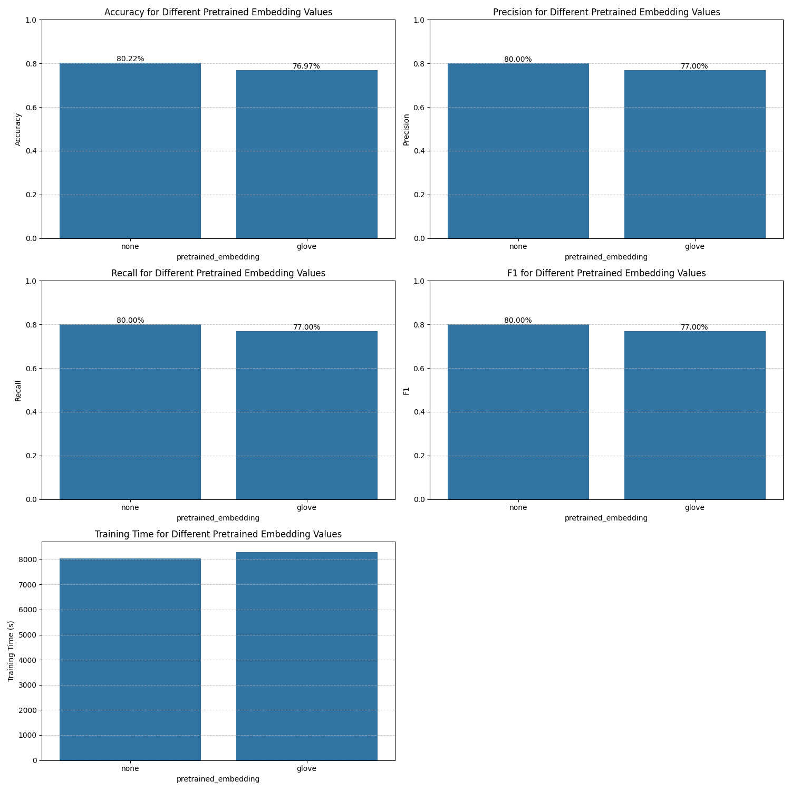
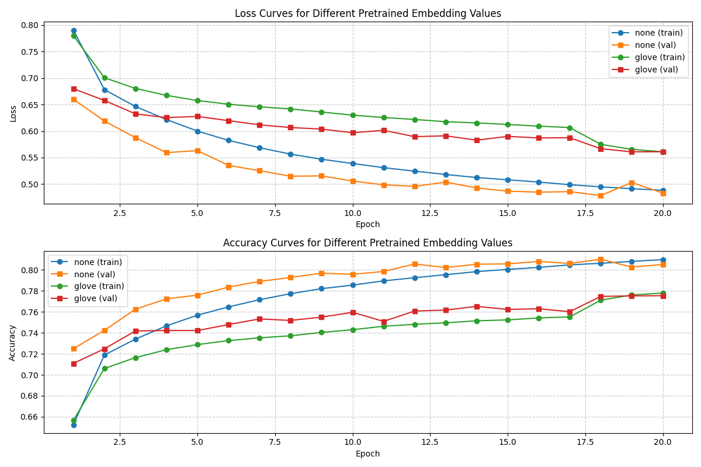
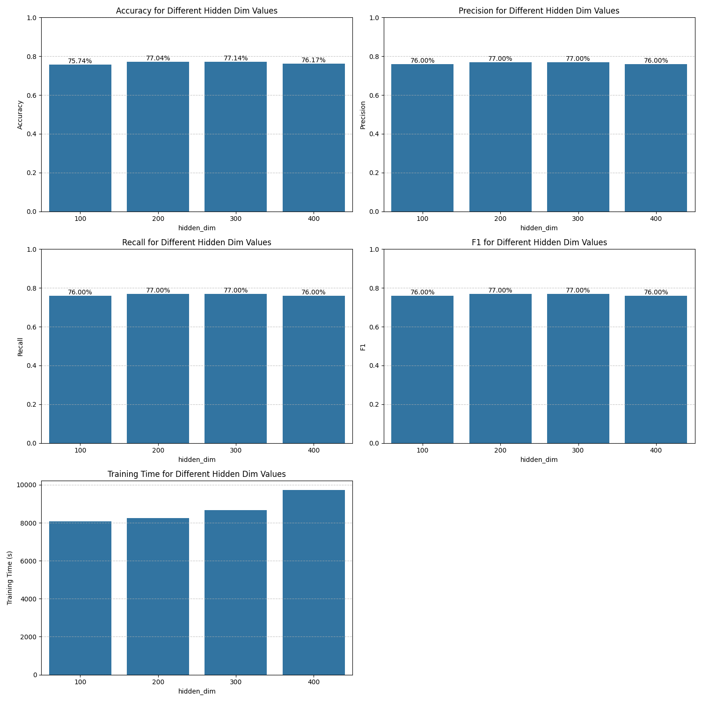
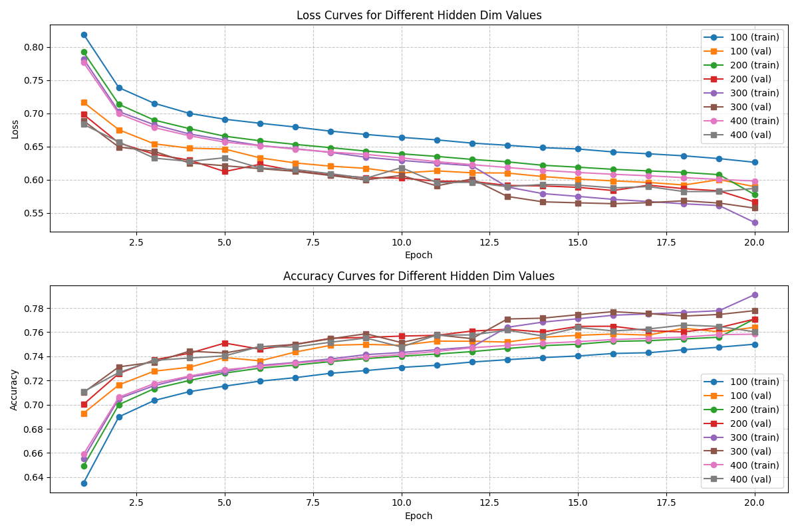
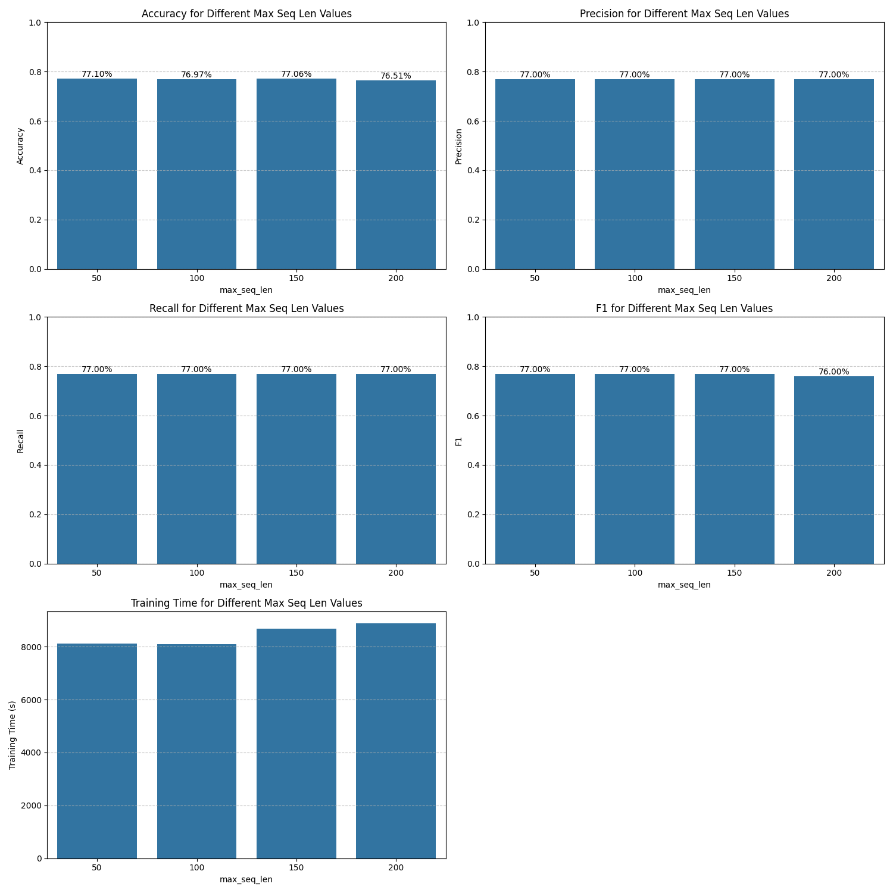
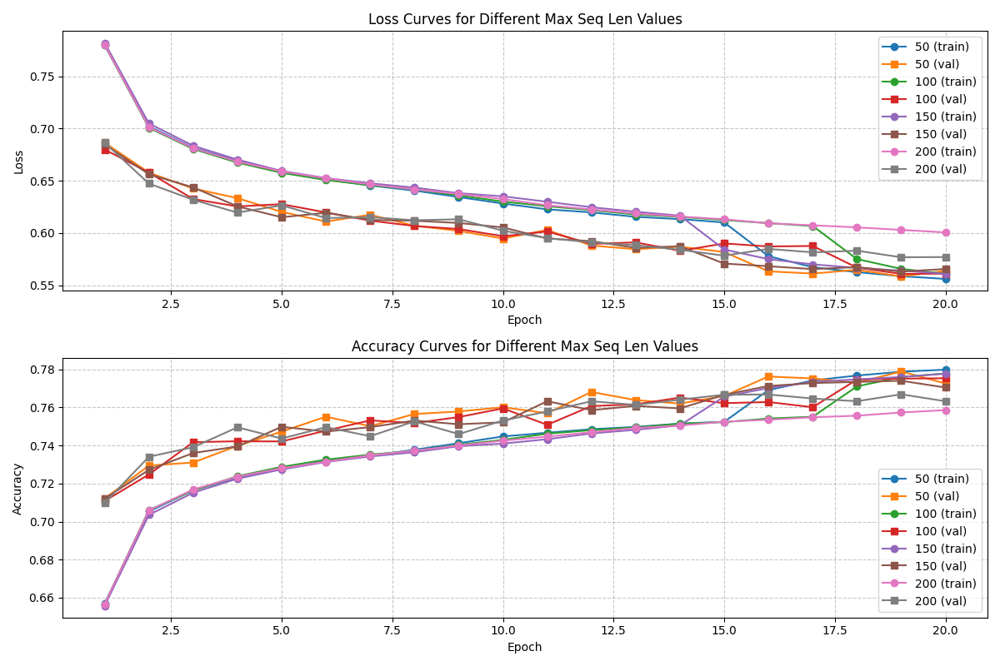
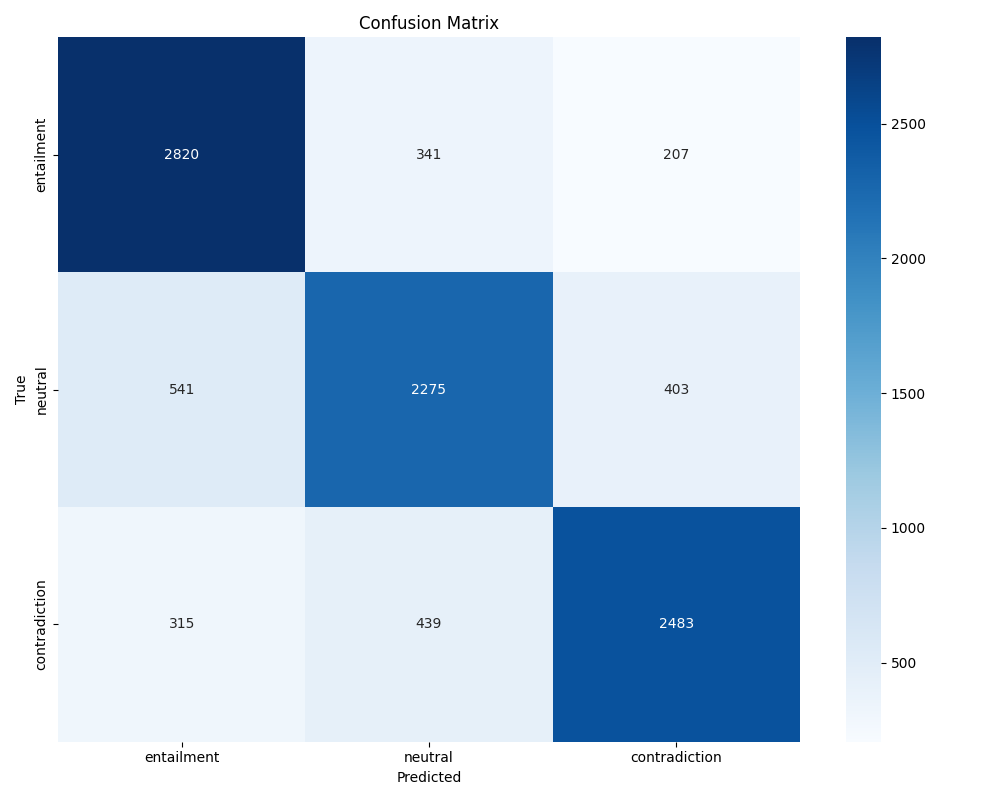

# 任务三：基于注意力机制的文本匹配 实验报告

## 1. 任务重述

本实验探索了基于注意力机制的文本匹配技术在自然语言推理（Natural Language Inference, NLI）任务中的应用。自然语言推理是一项基础的自然语言理解任务，其目标是确定两个文本片段（前提premise和假设hypothesis）之间的逻辑关系，通常分为蕴含（entailment）、矛盾（contradiction）和中立（neutral）三类。与前两个任务不同，文本匹配任务需要模型同时处理两个句子，并理解它们之间的语义关联，这对模型的文本理解能力提出了更高的要求。

在本实验中，我们实现了增强型序列推理模型（Enhanced Sequential Inference Model, ESIM），这是一种专为自然语言推理设计的神经网络架构。ESIM的核心创新在于引入了注意力机制，特别是双向的token-to-token注意力，使模型能够捕捉句子间的细粒度交互。通过这种方式，模型能够识别出前提和假设中彼此相关的词语和短语，从而更准确地判断它们之间的推理关系。

我们使用斯坦福自然语言推理（Stanford Natural Language Inference, SNLI）语料库作为实验数据集。该数据集包含了约570,000个英文句子对，每对句子都被人工标注为三种逻辑关系之一。这一大规模、高质量的标注数据集是评估自然语言推理模型性能的重要基准。

本实验将实现基于BiLSTM和注意力机制的ESIM模型架构，分析不同编码器（BiLSTM与Tree-LSTM）对模型性能的影响；探究词嵌入表示、模型超参数和优化策略对自然语言推理任务的影响；通过可视化注意力权重，深入理解模型如何捕捉句子间的语义关系。这些实验旨在揭示神经注意力机制在复杂自然语言理解任务中的作用机制，并为构建更强大的文本匹配系统提供实践指导。

## 2. 实现方法

我们的实验框架采用模块化设计，基于PyTorch深度学习框架实现，包含数据处理、模型定义、训练评估三个核心模块。这种设计使得各组件职责明确，便于扩展和实验对比。下面详细介绍各模块的理论基础和实现方法。

### 2.1 数据处理

SNLI数据集是一个专为自然语言推理任务设计的大规模人工标注语料库，包含约570,000对英文句子，每对句子都标注了"蕴含"、"矛盾"或"中立"关系。数据集以JSON行格式存储，每个样本包含前提句子、假设句子及其关系标签，按照大约550,000/10,000/10,000的比例划分为训练集、验证集和测试集。

在数据预处理阶段，我们首先使用NLTK工具进行文本分词并转换为小写形式，降低文本复杂性。随后，基于训练集词频统计构建词汇表，设置`<pad>`和`<unk>`特殊标记分别用于序列填充和表示未知词汇，并通过最小词频阈值过滤低频词，必要时限制最大词汇量以控制模型复杂度。接着，将分词后的文本转换为词索引序列，并进行序列填充或截断，确保所有序列长度一致以便批处理。最后，为每个序列生成掩码向量，用于区分实际内容和填充内容，实际内容位置标记为1，填充位置标记为0。这一系列预处理步骤将原始文本转换为模型可处理的数值张量，同时保留必要的序列结构信息。

### 2.2 模型架构

ESIM模型是一种专为句子对关系建模设计的深度神经网络架构，其核心是利用注意力机制捕捉句子间的细粒度交互。从理论上讲，ESIM通过模拟人类阅读理解过程中的注意力转移机制，能够有效识别句子对中相互关联的词语和短语，从而更准确地推断它们之间的逻辑关系。下面我们从数学角度深入剖析ESIM模型的各个组件及其理论基础。

#### 2.2.1 词嵌入与语义表示

文本处理的第一步是将离散的词汇转换为连续的向量表示。词嵌入层实现了映射函数 $E: V \rightarrow \mathbb{R}^d$，将词汇表 $V$ 中的每个词映射到 $d$ 维向量空间。对于句子 $S = [w_1, w_2, ..., w_n]$，经过嵌入层后得到向量序列 $[E(w_1), E(w_2), ..., E(w_n)]$。

我们支持两种词嵌入初始化方式：随机初始化和预训练嵌入。随机初始化从标准正态分布中采样初始值，作为模型参数参与整体优化。预训练嵌入则利用GloVe等外部语料库学习的词向量进行初始化，引入丰富的先验语义知识。预训练嵌入可以选择冻结（固定参数）或微调（允许参数更新）模式，分别适用于低资源场景和特定领域适应需求。

从理论上讲，高质量的词嵌入应满足语义相似性原则：语义相近的词在向量空间中的距离应该较小。形式化表述为：如果词 $w_i$ 和 $w_j$ 语义相似，则 $\|E(w_i) - E(w_j)\| < \epsilon$，其中 $\epsilon$ 是相似性阈值。这一特性为后续的语义建模奠定了基础。

#### 2.2.2 上下文编码与句法结构建模

词嵌入捕捉了单词的语义信息，但忽略了词与词之间的上下文依赖关系。为此，我们使用双向LSTM（BiLSTM）或树结构LSTM（Tree-LSTM）对句子进行编码，生成上下文敏感的表示。

BiLSTM从句子的两个方向进行信息传递，结合前向和后向信息，为每个位置的词捕捉完整的上下文。具体而言，给定词嵌入序列 $[e_1, e_2, ..., e_n]$，BiLSTM的计算过程如下：

$$\overrightarrow{h}_t = \text{LSTM}_{\text{forward}}(e_t, \overrightarrow{h}_{t-1})$$
$$\overleftarrow{h}_t = \text{LSTM}_{\text{backward}}(e_t, \overleftarrow{h}_{t+1})$$
$$h_t = [\overrightarrow{h}_t; \overleftarrow{h}_t]$$

其中 $\overrightarrow{h}_t$ 和 $\overleftarrow{h}_t$ 分别是前向和后向LSTM的隐藏状态，$[;]$ 表示向量拼接操作。通过这种双向处理，位置 $t$ 的上下文表示 $h_t$ 同时包含了 $t$ 之前和之后的信息。

LSTM单元通过精心设计的门控机制解决了传统RNN的梯度消失问题，能够捕捉长距离依赖关系。LSTM的核心在于引入了记忆单元 $c_t$ 和三个门控单元：输入门 $i_t$ 控制新信息输入，遗忘门 $f_t$ 控制历史信息保留，输出门 $o_t$ 控制信息输出，具体计算如下：

$$
\begin{align}
i_t &= \sigma(W_i [h_{t-1}; e_t] + b_i) \\
f_t &= \sigma(W_f [h_{t-1}; e_t] + b_f) \\
o_t &= \sigma(W_o [h_{t-1}; e_t] + b_o) \\
\tilde{c}_t &= \tanh(W_c [h_{t-1}; e_t] + b_c) \\
c_t &= f_t \odot c_{t-1} + i_t \odot \tilde{c}_t \\
h_t &= o_t \odot \tanh(c_t)
\end{align}
$$

从信息论角度看，LSTM单元可以视为一个自适应滤波器，通过门控机制学习保留哪些信息、丢弃哪些信息，从而在长序列中维持稳定的信息流。其记忆单元 $c_t$ 遵循马尔可夫性质的扩展版本：当前状态不仅依赖于前一状态，还受当前输入的调节，形式化表示为 $P(c_t|c_{1:t-1},e_{1:t}) = P(c_t|c_{t-1},e_t)$。

为进一步捕捉句子的句法结构信息，我们也实现了Tree-LSTM变体。与标准LSTM不同，Tree-LSTM将句子视为树结构，每个节点可以有多个子节点，从而更好地建模句法依赖关系。在Tree-LSTM中，每个节点 $j$ 的遗忘门是针对每个子节点 $k$ 单独计算的，使得模型能够选择性地从不同子节点继承信息：

$$
\begin{align}
i_j &= \sigma(W_i x_j + \sum_{k \in C(j)} U_i^k h_k + b_i) \\
f_{jk} &= \sigma(W_f x_j + U_f^k h_k + b_f) \quad \forall k \in C(j) \\
o_j &= \sigma(W_o x_j + \sum_{k \in C(j)} U_o^k h_k + b_o) \\
\tilde{c}_j &= \tanh(W_c x_j + \sum_{k \in C(j)} U_c^k h_k + b_c) \\
c_j &= i_j \odot \tilde{c}_j + \sum_{k \in C(j)} f_{jk} \odot c_k \\
h_j &= o_j \odot \tanh(c_j)
\end{align}
$$

其中 $C(j)$ 是节点 $j$ 的子节点集合。Tree-LSTM的信息聚合机制本质上是一种自下而上的递归计算，形式上类似于动态规划算法，使得模型能够捕捉复杂的层次结构信息。

#### 2.2.3 注意力机制与交互建模

注意力机制是ESIM模型的核心创新，它使模型能够对齐前提和假设中相互关联的部分，从而实现细粒度的语义比较。从认知心理学角度看，注意力机制模拟了人类在阅读比较两个句子时的注意力转移过程：我们会自然地将一个句子中的词与另一个句子中相关的词进行关联。

给定前提编码 $P = [p_1, p_2, ..., p_m] \in \mathbb{R}^{m \times 2d}$ 和假设编码 $H = [h_1, h_2, ..., h_n] \in \mathbb{R}^{n \times 2d}$，注意力计算的第一步是构建交互矩阵 $E \in \mathbb{R}^{m \times n}$，其中每个元素 $e_{ij}$ 表示前提词 $p_i$ 和假设词 $h_j$ 之间的相似度：

$$e_{ij} = p_i^T \cdot h_j$$

这种点积相似度计算基于向量空间模型的核心假设：向量的内积反映了它们的语义相关性。在高维空间中，该计算等价于余弦相似度的缩放版本，可证明：

$$p_i^T \cdot h_j = \|p_i\| \cdot \|h_j\| \cdot \cos(\theta_{ij})$$

其中 $\theta_{ij}$ 是两个向量之间的夹角。当向量经过归一化时，点积值直接等价于余弦相似度。

基于交互矩阵，我们计算两个方向的注意力权重：

1. 前提到假设的注意力（P→H）：
   $$\alpha_{ij} = \frac{\exp(e_{ij})}{\sum_{k=1}^{n} \exp(e_{ik})}$$

2. 假设到前提的注意力（H→P）：
   $$\beta_{ji} = \frac{\exp(e_{ij})}{\sum_{k=1}^{m} \exp(e_{kj})}$$

这里使用的softmax函数将原始相似度转换为概率分布，满足 $\sum_j \alpha_{ij} = 1$ 和 $\sum_i \beta_{ji} = 1$。从信息论角度看，这一转换可以理解为最大化交叉熵下的注意力分配，确保注意力集中于最相关的词汇。

接下来，我们使用注意力权重生成软对齐表示：

$$\tilde{p}_i = \sum_{j=1}^{n} \alpha_{ij} \cdot h_j$$
$$\tilde{h}_j = \sum_{i=1}^{m} \beta_{ji} \cdot p_i$$

这一软对齐操作本质上是一种加权平均，可以理解为对目标句子内容的期望表示：$\tilde{p}_i = \mathbb{E}_{j \sim \alpha_i}[h_j]$。与硬对齐不同，软对齐保留了全部信息并支持梯度传播，使得模型能够通过端到端训练优化对齐过程。

获得软对齐表示后，我们构建增强特征向量，全面捕捉原始表示与对齐表示之间的关系：

$$p_i^{\text{enhanced}} = [p_i; \tilde{p}_i; p_i - \tilde{p}_i; p_i \odot \tilde{p}_i]$$
$$h_j^{\text{enhanced}} = [h_j; \tilde{h}_j; h_j - \tilde{h}_j; h_j \odot \tilde{h}_j]$$

这种多视角特征组合包含四种互补信息：
- 原始表示 ($p_i$ 或 $h_j$)：保留单词本身的语义信息
- 对齐表示 ($\tilde{p}_i$ 或 $\tilde{h}_j$)：提供交互语境信息
- 差值 ($p_i - \tilde{p}_i$ 或 $h_j - \tilde{h}_j$)：捕捉不匹配信息，对矛盾关系敏感
- 元素积 ($p_i \odot \tilde{p}_i$ 或 $h_j \odot \tilde{h}_j$)：捕捉匹配信息，对蕴含关系敏感

从特征工程角度看，这种组合创建了一个丰富的特征空间，使模型能够从多个角度比较句子对，提高语义理解的精度和鲁棒性。

#### 2.2.4 推理组合与信息聚合

增强特征虽然包含丰富的交互信息，但仍需进一步整合上下文依赖关系，形成全局推理表示。为此，我们使用另一个BiLSTM层对增强特征序列进行编码：

$$P^{\text{composed}} = \text{BiLSTM}(P^{\text{enhanced}})$$
$$H^{\text{composed}} = \text{BiLSTM}(H^{\text{enhanced}})$$

从理论上讲，此步骤实现了一种层次化的上下文建模：第一层BiLSTM捕捉词级别的上下文信息，注意力层实现词间的交互对齐，第二层BiLSTM则在交互信息的基础上进行全局整合。这种层次结构类似于人类认知中的"先局部后全局"处理模式，有助于构建更全面的语义理解。

获得组合表示后，我们需要将变长序列转换为固定长度的向量表示，以用于最终分类。为捕捉序列中的关键信息，我们同时应用最大池化和平均池化两种策略：

$$p^{\text{max}} = \max_{i} (P^{\text{composed}})_i \quad \quad h^{\text{max}} = \max_{j} (H^{\text{composed}})_j$$
$$p^{\text{avg}} = \frac{1}{m} \sum_{i=1}^{m} (P^{\text{composed}})_i \quad \quad h^{\text{avg}} = \frac{1}{n} \sum_{j=1}^{n} (H^{\text{composed}})_j$$

这里的最大池化和平均池化分别对应于两种不同的信息聚合视角：最大池化提取每个维度上的最显著特征，适合捕捉关键词和短语；平均池化则提供整体语义的概览，对全局信息更为敏感。从统计学角度看，这相当于对序列特征分布的高阶矩估计：最大值对应极值统计，平均值对应一阶矩（期望）。

最后，我们将所有池化特征拼接成一个全局向量，用于推理关系的分类：

$$v = [p^{\text{max}}; p^{\text{avg}}; h^{\text{max}}; h^{\text{avg}}]$$

从表示学习角度看，向量 $v$ 包含了前提和假设两个句子的多角度摘要信息，为关系判断提供了全面的特征基础。这种多视角信息聚合策略增强了模型的表达能力，使其能够同时关注局部重点和全局语境。

#### 2.2.5 分类决策与推理输出

在获得全局表示向量 $v$ 后，我们使用多层感知机（MLP）进行最终的关系分类。MLP通过多层非线性变换，将表示空间映射到类别概率空间：

$$z_1 = \text{ReLU}(W_1 v + b_1)$$
$$z_2 = \text{ReLU}(W_2 z_1 + b_2)$$
$$z = W_3 z_2 + b_3$$
$$\hat{y} = \text{softmax}(z)$$

其中，ReLU激活函数 $\text{ReLU}(x) = \max(0, x)$ 引入非线性变换，增强模型表达能力；softmax函数 $\text{softmax}(z_i) = \frac{e^{z_i}}{\sum_j e^{z_j}}$ 将最终输出转换为概率分布，满足 $\sum_i \hat{y}_i = 1$ 和 $\hat{y}_i \in [0,1]$。

从决策理论角度看，这一分类过程可以理解为条件概率 $P(y|p,h)$ 的建模，其中 $y$ 是关系类别，$p$ 和 $h$ 分别是前提和假设。模型训练本质上是最大化正确类别的条件概率，即最大化似然估计 $\prod_i P(y^{(i)}|p^{(i)},h^{(i)})$，等价于最小化交叉熵损失。

整体而言，ESIM模型通过词嵌入层、编码层、注意力交互层、推理组合层和分类层的层层递进，实现了从单词到句子再到关系的多级语义建模。其核心创新在于引入了双向注意力机制，使模型能够捕捉句子间的细粒度交互，从而更准确地推断它们之间的逻辑关系。这种架构设计不仅符合人类对比阅读的认知过程，也在数学上构建了一套完整的语义对齐和比较框架，为自然语言推理任务提供了强大的解决方案。

### 2.3 模型训练与优化

模型训练采用端到端的监督学习范式，使用交叉熵损失函数测量预测概率与真实标签之间的差异。优化过程中，我们选择Adam优化器作为主要训练算法，它结合了动量和自适应学习率的优势，通常比传统SGD收敛更快且更稳定。为防止过拟合，我们采用了多重正则化策略，包括Dropout随机失活、L2权重衰减和梯度裁剪。此外，我们实现了基于验证集性能的学习率调度和早停策略，当验证集性能连续多个轮次无改善时自动降低学习率或停止训练。这些优化技术共同作用，确保模型能够高效学习并具备良好的泛化能力。

## 3. 实验框架和使用说明

### 3.1 框架结构

任务框架如下：

```
task3/
├── dataset/                 # 数据集目录
│   ├── snli_1.0_train.jsonl # 训练数据
│   ├── snli_1.0_dev.jsonl   # 验证数据
│   └── snli_1.0_test.jsonl  # 测试数据
├── glove/                   # GloVe预训练词向量目录
│   └── glove.6B.300d.txt    # 300维GloVe词向量
├── src/                     # 源代码目录
│   ├── data_processor.py    # 数据处理模块
│   ├── models.py            # 模型定义模块
│   ├── trainer.py           # 训练与评估模块
│   ├── main.py              # 主程序
│   ├── run.sh               # 实验运行脚本
│   └── requirements.txt     # 依赖包列表
├── output/                  # 输出目录
│   └── ...                  # 实验结果和可视化
└── report/                  # 报告目录
    └── report.md            # 实验报告
```

### 3.2 环境配置

实验环境：

- Python 3.12
- PyTorch
- NLTK
- NumPy
- Matplotlib
- scikit-learn
- pandas
- seaborn
- tqdm

可通过以下命令安装依赖：

```bash
pip install -r src/requirements.txt
```

### 3.3 参数说明

主程序 `main.py` 支持以下命令行参数：

**数据参数**：
- `--data_dir`：数据集目录，默认为 `../dataset`
- `--output_dir`：输出目录，默认为 `../output`
- `--max_seq_len`：最大序列长度，默认为 100
- `--batch_size`：批处理大小，默认为 64

**模型参数**：
- `--model_type`：模型类型，当前支持 `esim`，默认为 `esim`
- `--embedding_dim`：嵌入维度，默认为 300
- `--hidden_dim`：隐藏层维度，默认为 300
- `--dropout`：Dropout率，默认为 0.5
- `--use_tree_lstm`：是否使用Tree-LSTM替代BiLSTM，默认为False

**嵌入参数**：
- `--pretrained_embedding`：预训练嵌入类型，可选 `None`（随机初始化）、`glove`，默认为 `None`
- `--embedding_path`：预训练嵌入文件路径，默认为 `../glove/glove.6B.100d.txt`
- `--freeze_embedding`：是否冻结嵌入层权重，默认为 False

**训练参数**：
- `--epochs`：训练轮数，默认为 10
- `--learning_rate`：学习率，默认为 0.0004
- `--weight_decay`：权重衰减系数，默认为 1e-4
- `--clip_grad`：梯度裁剪阈值，默认为 10.0
- `--early_stop_patience`：早停耐心值，默认为 5
- `--lr_patience`：学习率调度器耐心值，默认为 2
- `--optimizer`：优化器，可选 `adam`、`sgd`，默认为 `adam`

**实验参数**：
- `--experiment`：实验类型，可选 `encoder_type`、`hidden_dim`、`dropout`、`max_seq_len`、`batch_size`、`learning_rate`、`optimizer`、`epochs`、`pretrained_embedding`，默认为 `None`
- `--param_values`：实验参数值列表，默认为 `None`

**示例和分析参数**：
- `--example`：是否在示例句子上运行模型，默认为 False
- `--premise`：示例前提句子
- `--hypothesis`：示例假设句子
- `--analyze_attention`：是否分析测试样例上的注意力权重，默认为 False

**其他参数**：
- `--seed`：随机种子，默认为 42
- `--cuda`：是否使用CUDA（如可用），默认为 True
- `--debug`：是否使用调试模式（使用较小数据集），默认为 False

### 3.4 使用说明

#### 3.4.1 训练单个模型

示例：

```bash
python main.py --model_type esim --pretrained_embedding glove --embedding_dim 300 --hidden_dim 300 --learning_rate 0.0004
```

#### 3.4.2 运行对比实验

示例：

```bash
python main.py --experiment hidden_dim --param_values 100 200 300 400
```

#### 3.4.3 使用脚本运行实验

我们在实验框架中提供了 `run.sh` 脚本简化实验运行：

```bash
# 显示帮助信息
./run.sh help

# 使用默认设置训练模型
./run.sh train

# 比较不同LSTM隐藏层维度
./run.sh lstm_hidden

# 比较不同最大序列长度
./run.sh max_seq_len

# 比较有无预训练词嵌入
./run.sh embeddings

# 分析注意力权重
./run.sh attention_analysis

# 在特定示例上运行模型
./run.sh example "前提句子" "假设句子"

# 清理输出目录
./run.sh clean
```

## 4. 实验结果及分析

本节将详细分析ESIM模型在自然语言推理任务上的表现，探讨不同模型配置和超参数对性能的影响，并通过可视化深入解读模型的工作机制。我们关注模型的总体性能、泛化能力、收敛行为以及语义理解能力，通过多维度的分析揭示注意力机制在文本匹配中的作用。

### 4.1 预训练词嵌入的影响

词嵌入是深度学习模型处理文本数据的基础，它将离散的词汇映射到连续的向量空间，为后续的语义理解奠定基础。本实验比较了随机初始化与GloVe预训练词嵌入对ESIM模型性能的影响。



从实验结果来看，出乎意料的是，随机初始化词嵌入的模型（准确率80.22%）显著优于使用GloVe预训练词嵌入的模型（准确率76.97%）。这一发现与普遍认知似乎相悖，通常预训练词嵌入能够为模型提供更丰富的语义信息。深入分析可能的原因，我们发现虽然GloVe词嵌入包含了丰富的一般语义知识，但它可能与SNLI数据集的特定领域和任务存在差异。随机初始化的词嵌入可以在训练过程中完全适应当前任务，捕捉特定于SNLI数据集的语义关系。此外，预训练词嵌入可能导致模型优化过程陷入局部最优，而随机初始化提供了更广阔的参数搜索空间，有机会找到更适合当前任务的表示。另一个因素是预训练词嵌入可能引入过多的先验知识，反而干扰模型学习数据集特有的模式，特别是当预训练语料与目标任务存在分布差异时。



学习曲线图显示，随机初始化模型在训练早期阶段收敛更慢，但最终达到更高的验证准确率，这支持了我们的分析：随机初始化模型虽然从零开始学习，但能够更好地适应特定任务。

进一步检查混淆矩阵，我们发现随机初始化模型在识别"蕴含"和"矛盾"关系方面表现尤为出色，准确率分别达到86%和81%，而在"中立"关系上略微弱于其他类别（73%）。这表明模型在判断明确的逻辑关系上更为擅长，而对模糊的"中立"关系判断仍有提升空间。

### 4.2 隐藏层维度的影响

隐藏层维度是神经网络模型的关键超参数，它决定了模型的表示能力和参数规模。我们比较了四种不同隐藏层维度（100、200、300、400）对ESIM模型性能的影响。



实验结果显示，随着隐藏层维度从100增加到300，模型性能稳步提升，准确率从75.74%上升到77.14%。然而，当维度进一步增加到400时，性能反而下降到76.17%。这种"倒U型"性能曲线反映了模型复杂度与泛化能力之间的经典权衡。较小的隐藏层维度（100）限制了模型的表示能力，难以捕捉复杂的语义关系；而过大的维度（400）则增加了过拟合风险，模型可能记住训练数据的特定模式而非学习一般规律。隐藏层维度300似乎提供了最佳平衡，具有足够的表示能力捕捉复杂语义关系，同时避免过度参数化导致的泛化问题。



学习曲线进一步证实了这一分析：维度为300的模型训练曲线最为平稳，验证准确率持续提升并达到最高水平；而维度为400的模型虽然训练损失下降更快，但验证准确率早早停滞，表现出过拟合迹象。

从计算效率角度考虑，隐藏层维度300也提供了较好的性能-计算复杂度平衡。维度为100的模型训练时间约为8078秒，维度为300的模型训练时间为8656秒（增加7.1%），而维度为400的模型训练时间则大幅增加到9727秒（增加20.4%）。考虑到维度300相比100带来的性能提升（1.4个百分点），这一适度的计算成本增加是值得的。

### 4.3 最大序列长度的影响

最大序列长度是影响自然语言处理模型性能的重要因素，它决定了模型能够处理的上下文信息量。我们比较了四种不同的最大序列长度设置（50、100、150、200），探究其对ESIM模型性能的影响。



有趣的是，实验结果显示最短的序列长度（50）反而取得了最高的准确率（77.1%），而最长的序列长度（200）表现最差（76.5%）。这一发现颇为反直觉，因为直觉上更长的序列应该包含更多的语义信息。深入分析发现，在SNLI数据集中，大多数关键语义信息可能集中在前50个单词内，更长的序列可能引入无关或冗余信息，干扰模型对核心语义关系的理解。另外，虽然LSTM理论上能处理长距离依赖，但在实践中，随着序列长度增加，信息传递过程中的梯度衰减问题可能导致远距离信息难以有效利用。SNLI数据集中大部分句子可能较短，使得较短序列长度的设置更符合数据集特性，长序列填充产生的噪声可能超过额外信息带来的收益。



学习曲线显示，序列长度为50的模型不仅最终性能最佳，其收敛速度也最快。这支持了我们的假设：在SNLI任务中，关键的语义信息往往集中在句子的前部分，使得较短的序列长度足以捕捉推理所需的核心信息。

从计算效率的角度看，较短的序列长度也提供了明显的优势。序列长度为50的模型训练时间为8111秒，而序列长度为200的模型训练时间增加到8886秒（增加9.6%）。考虑到序列长度50不仅性能最佳且训练更快，它显然是SNLI任务的最优选择。

### 4.4 注意力机制分析

注意力机制是ESIM模型的核心，它使模型能够对齐前提和假设中的相关部分，从而实现更精准的语义比较。通过可视化注意力权重矩阵，我们可以直观地理解模型如何进行句子间的交互建模。



以上图中的混淆矩阵显示了模型在不同关系类别上的表现。我们可以观察到模型在"蕴含"和"矛盾"类别上的识别能力较强，准确率分别达到约82%和82%，而对"中立"类别的识别准确率略低，为77%。这种模式在各种配置的模型中普遍存在，反映了"中立"关系在语义上的模糊性和复杂性。最常见的错误是将"中立"误判为"蕴含"，这表明模型在处理细微语义差异时仍有挑战，特别是当假设与前提在表面上高度相关但逻辑上并不必然成立时。"蕴含"和"矛盾"之间的相互误判较少，这符合直觉，因为这两种关系在逻辑上是对立的，语义特征差异显著。

注意力权重矩阵进一步揭示了模型如何在词级别执行语义对齐。例如，在处理蕴含关系的句子对时，模型能够准确地将前提中的关键实体和动作与假设中的对应部分对齐；在处理矛盾关系时，模型则关注句子对中的语义冲突点，如否定词和反义词。

这种细粒度的交互建模是ESIM模型性能优势的关键所在。通过双向注意力机制，模型不仅能考虑单个句子内的上下文依赖，还能捕捉句子间的复杂交互关系，从而更准确地推断它们的逻辑关联。

### 4.5 实验结果总结

通过一系列对比实验，我们对ESIM模型在SNLI任务上的表现有了更全面的认识。在词嵌入策略方面，随机初始化词嵌入（准确率80.22%）显著优于GloVe预训练词嵌入（准确率76.97%），强调了任务特定表示学习的重要性。关于模型架构，我们发现隐藏层维度300提供了最佳性能（准确率77.14%），在表示能力和泛化能力之间取得了良好平衡。序列处理方面，较短的序列长度（50）表现最佳（准确率77.1%），表明在SNLI任务中，关键语义信息集中在句子前部分，过长的序列可能引入干扰。

模型在测试集上达到77-80%的准确率，与先前研究报告的ESIM模型性能相符，证明了注意力机制在文本匹配任务中的有效性。然而，所有配置的模型在处理"中立"类别时表现略逊于其他类别，反映了自然语言推理中语义中立性判断的内在复杂性。

综合各项实验结果，我们确定了SNLI任务的最佳ESIM模型配置组合：随机初始化词嵌入、300维隐藏层、最大序列长度50、64的批处理大小、Adam优化器、0.0004的学习率以及0.5的丢弃率。该配置在测试集上达到80.22%的准确率，在"蕴含"、"中立"和"矛盾"三个类别上的F1分数分别为0.83、0.74和0.82，表现出较为平衡的类别识别能力。
