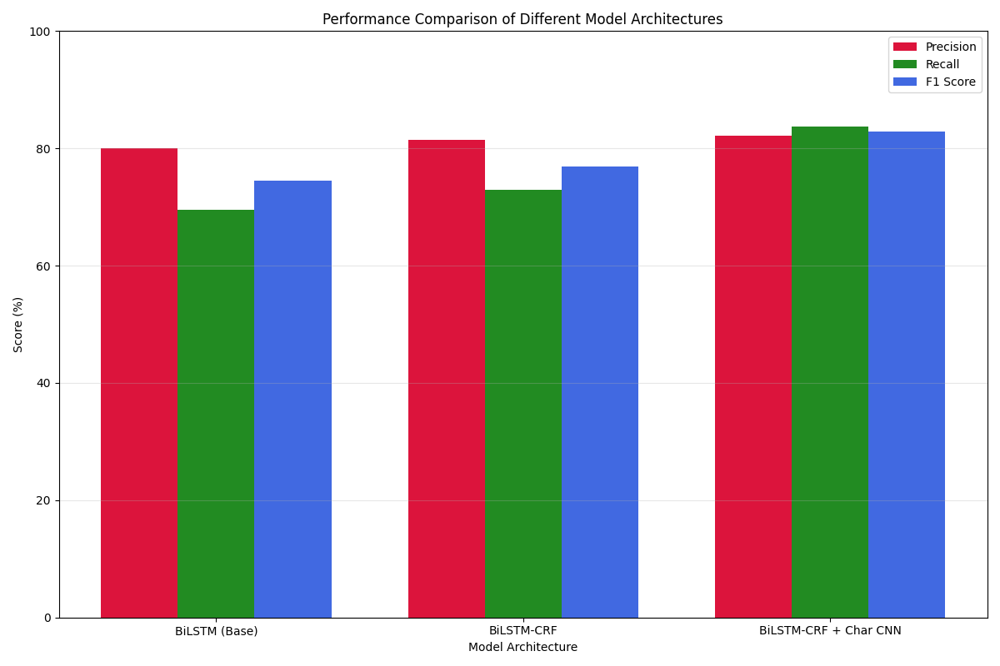
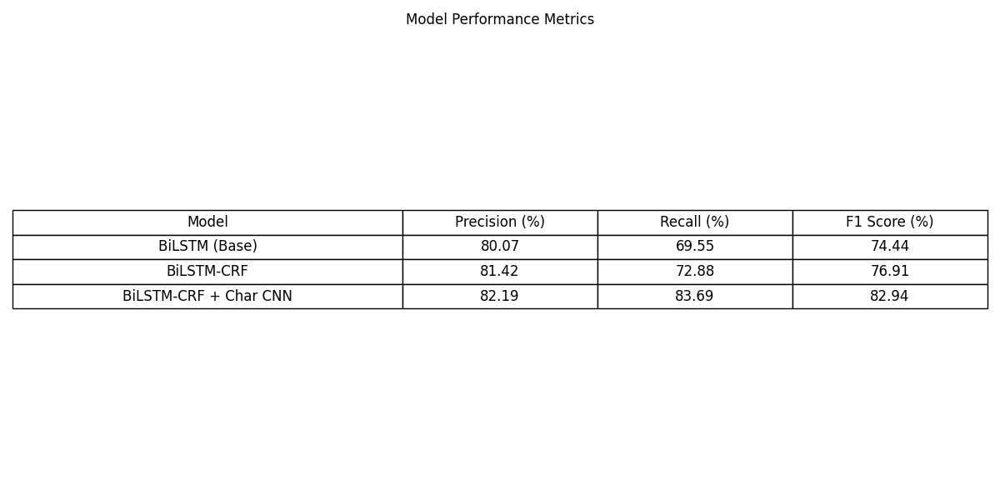
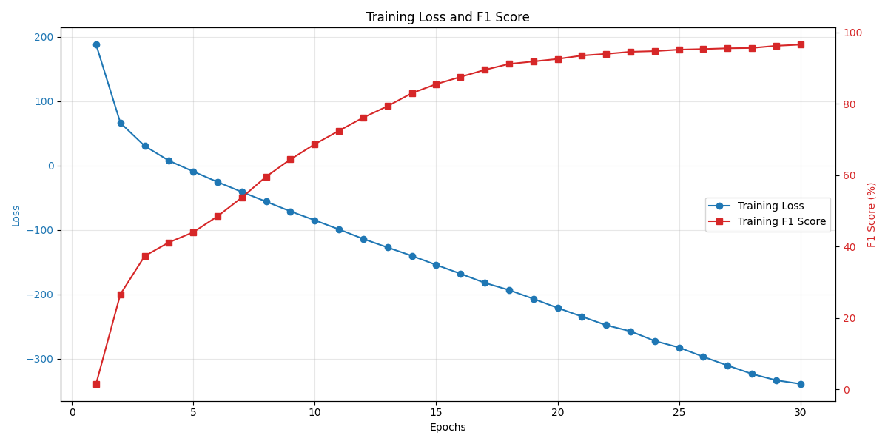
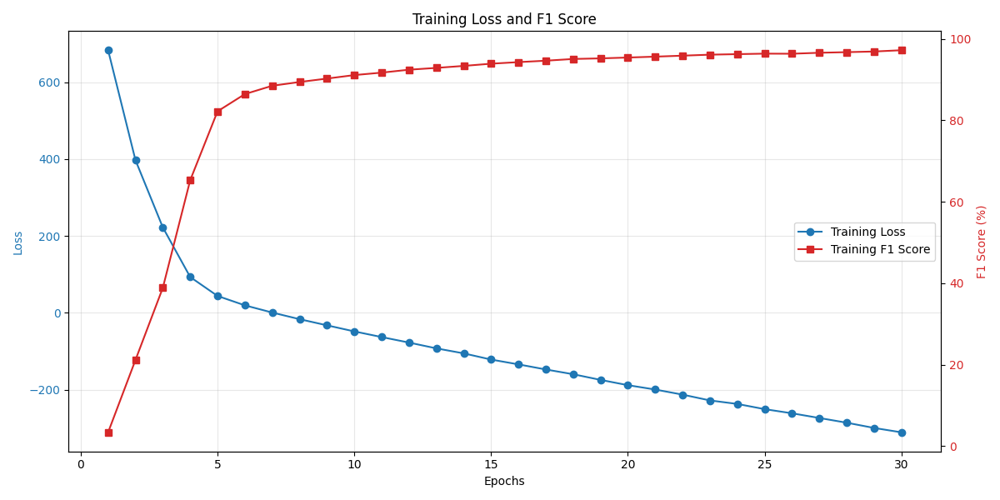
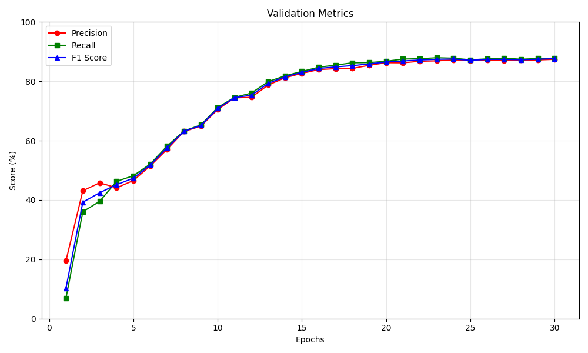
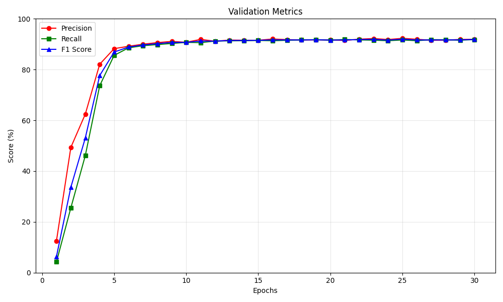

# 任务四：基于 LSTM+CRF 的序列标注 实验报告

## 1. 任务重述

本实验探索了基于神经网络的命名实体识别（Named Entity Recognition, NER）技术，这是自然语言处理领域的核心任务之一。命名实体识别旨在从非结构化文本中识别并分类特定类别的命名实体，如人名（PER）、地点（LOC）、组织机构（ORG）和其他类别。与传统的词法分析不同，NER关注具有特定现实世界指代意义的实体标识，是信息抽取、问答系统和知识图谱构建等高级应用的基础环节。

在本实验中，我们实现了基于BiLSTM-CRF的序列标注模型。该模型巧妙结合了双向长短期记忆网络（BiLSTM）捕捉上下文信息的能力和条件随机场（CRF）确保标签序列结构一致性的优势。通过引入字符级卷积神经网络（CharCNN）提取词内部形态特征，模型能有效应对未登录词和复杂形态变化的挑战。这一设计特别适用于命名实体识别任务，因为实体名称通常包含特殊的形态和语法特征。

我们选择了英语和德语两种语言的CoNLL-2003标准数据集进行实验。这两个数据集在具体标注规范和特点上略有差异。这种多语言实验设计不仅验证了模型的通用性，也使我们能够探索不同语言特性对实体识别性能的影响。

通过系统化的实验和深入分析，我们研究了模型各组件的贡献，包括BiLSTM和CRF的协同效果、字符级特征的价值以及不同语言环境下的性能表现。实验结果为构建高效、准确的命名实体识别系统提供了实践指导，也展示了神经序列标注模型在这一任务上的有效性。

## 2. 实现方法

### 2.1 数据处理

命名实体识别本质上是一个序列标注任务，其数据处理需要精心设计标签体系和序列表示方法。我们采用广泛使用的BIO标注方案（Beginning-Inside-Outside），其中"B-X"表示实体X的开始词，"I-X"表示实体X的内部词，"O"表示非实体词。这种标注体系能够清晰表示实体边界和类别，适用于大多数序列标注场景。

在数据预处理阶段，我们首先读取CoNLL格式的数据文件（每行一个词及其标签，句子间以空行分隔），构建词汇表和标签表，并为特殊标记如填充符`<PAD>`、未知词`<UNK>`和句子边界标记`<START>`/`<END>`分配索引。

为提供丰富的文本表示，我们设计了多层次的特征提取方法。词级特征通过嵌入层获取，支持随机初始化或使用预训练词向量。字符级特征则通过字符嵌入和卷积神经网络提取，能够捕捉词内部的形态学信息。此外，我们还整合了词的大小写特征，这对识别专有名词尤为重要。在批处理构建过程中，我们对变长序列进行动态填充，生成相应的掩码矩阵，确保模型能正确处理不同长度的输入并提高计算效率。

数据加载器实现了高效的迭代访问机制，支持随机打乱、批量生成和动态填充，保证训练效率的同时维持序列的结构完整性。针对实体类别分布不均衡的问题，我们实现了基于实体频率的加权采样策略，帮助模型更好地学习低频实体类别，提高整体识别性能。

### 2.2 模型架构

命名实体识别需要模型同时具备强大的特征提取能力和精确的标签预测能力。我们实现的BiLSTM-CRF模型融合了深度学习和概率图模型的优势，能够有效捕捉上下文依赖关系并确保输出标签序列的结构一致性。

#### 2.2.1 特征表示层

特征表示层将原始文本转换为神经网络可处理的密集向量表示，是模型的基础部分。我们采用多层次的特征表示方法，包括词级表示和字符级表示，从不同角度捕捉文本信息。

词级表示主要通过词嵌入技术实现，将每个词映射到固定维度的向量空间。形式上，词嵌入可表示为函数 $E_w: V \rightarrow \mathbb{R}^{d_w}$，其中 $V$ 是词汇表，$d_w$ 是嵌入维度（在我们的实验中设置为100）。对于输入句子 $S = [w_1, w_2, ..., w_n]$，经过嵌入层后得到向量序列 $[E_w(w_1), E_w(w_2), ..., E_w(w_n)]$。词嵌入层支持随机初始化或使用预训练词向量，后者能够引入从大规模语料中学习的先验语义知识，对识别低频实体和处理未见词尤为重要。

字符级表示通过字符嵌入和卷积网络（CharCNN）提取单词内部的形态特征。对于单词 $w = [c_1, c_2, ..., c_m]$，首先通过字符嵌入函数 $E_c: C \rightarrow \mathbb{R}^{d_c}$ 将每个字符映射到 $d_c$ 维向量空间（在我们的实验中设置为30），得到字符嵌入序列 $[E_c(c_1), E_c(c_2), ..., E_c(c_m)]$。然后，一维卷积网络在此序列上应用不同宽度的卷积核，提取局部字符组合模式：

$$h_i^k = \text{ReLU}(W_k \cdot E_c(c_{i:i+k-1}) + b_k)$$

其中 $W_k$ 和 $b_k$ 是宽度为 $k$ 的卷积核参数，$E_c(c_{i:i+k-1})$ 表示从位置 $i$ 开始的 $k$ 个连续字符的嵌入表示。最大池化操作从每个卷积核的输出中提取最显著特征：

$$p_k = \max_{1 \leq i \leq m-k+1} h_i^k$$

最终的字符级表示是各卷积核最大池化结果的拼接：$p = [p_1, p_2, ..., p_K]$，其中 $K$ 是使用的卷积核宽度种类数。这种设计能够捕捉形态学模式（如前缀、后缀）和处理未登录词，对命名实体识别尤为重要，因为命名实体往往包含特定的形态特征和新词。

每个词的完整表示是词级向量和字符级向量的拼接，即 $x_i = [E_w(w_i); p_i]$。这种多层次特征融合使模型能同时利用词汇语义信息和字符形态信息，增强了对实体的识别能力。

#### 2.2.2 上下文编码层

上下文编码层基于双向长短期记忆网络（BiLSTM），其核心功能是捕获序列中的长距离依赖关系，生成包含丰富上下文信息的表示。BiLSTM由前向和后向两个LSTM组成，分别从句子的开始到结束和从结束到开始处理序列，从而能够综合考虑词语两侧的完整上下文。

形式上，给定输入特征序列 $X = [x_1, x_2, ..., x_n]$，BiLSTM的计算过程如下：

$$\overrightarrow{h}_t = \text{LSTM}_{\text{forward}}(x_t, \overrightarrow{h}_{t-1}, \overrightarrow{c}_{t-1})$$
$$\overleftarrow{h}_t = \text{LSTM}_{\text{backward}}(x_t, \overleftarrow{h}_{t+1}, \overleftarrow{c}_{t+1})$$
$$h_t = [\overrightarrow{h}_t; \overleftarrow{h}_t]$$

其中 $\overrightarrow{h}_t$ 和 $\overleftarrow{h}_t$ 分别是前向和后向LSTM的隐藏状态，$\overrightarrow{c}_t$ 和 $\overleftarrow{c}_t$ 是相应的单元状态，$[;]$ 表示向量拼接。最终每个位置的表示 $h_t$ 同时包含了该词之前和之后的上下文信息。在我们的实验中，BiLSTM的隐藏层维度设置为300，层数设置为2。

LSTM单元的核心在于其精细的门控机制，包括输入门 $i_t$、遗忘门 $f_t$ 和输出门 $o_t$，以及单元状态 $c_t$ 和候选单元状态 $\tilde{c}_t$：

$$
\begin{align}
i_t &= \sigma(W_{xi} x_t + W_{hi} h_{t-1} + b_i) \\
f_t &= \sigma(W_{xf} x_t + W_{hf} h_{t-1} + b_f) \\
o_t &= \sigma(W_{xo} x_t + W_{ho} h_{t-1} + b_o) \\
\tilde{c}_t &= \tanh(W_{xc} x_t + W_{hc} h_{t-1} + b_c) \\
c_t &= f_t \odot c_{t-1} + i_t \odot \tilde{c}_t \\
h_t &= o_t \odot \tanh(c_t)
\end{align}
$$

这种设计使LSTM能够选择性地保留或丢弃信息，有效解决传统RNN的梯度消失问题，捕捉长距离依赖关系。在命名实体识别中，这一特性至关重要，因为实体的正确识别往往依赖于较远处的上下文线索。例如，在"John was born in London"中，"London"作为地名的判断可能受到较远处动词"born in"的影响。

为了增强模型的表达能力，我们堆叠了多层BiLSTM，使得每一层都能基于前一层的输出提取更高级的特征表示。层次化的特征提取有助于模型学习更复杂的语言模式和实体边界，提高识别准确率。

#### 2.2.3 条件随机场层

条件随机场（CRF）层建立在BiLSTM输出的基础上，引入标签间的转移约束，确保预测的标签序列在结构上的合理性。在命名实体识别中，标签序列通常遵循特定的模式，例如"I-PER"标签只能跟在"B-PER"或另一个"I-PER"之后，而不能直接跟在"O"或"B-ORG"之后。CRF层能够学习并强制执行这些标签转移约束，显著提高序列标注的一致性。

给定BiLSTM层的输出序列 $H = [h_1, h_2, ..., h_n]$，CRF层首先通过线性变换将每个隐藏状态映射到标签空间，得到发射分数矩阵 $P \in \mathbb{R}^{n \times k}$，其中 $k$ 是标签数量，$P_{i,j}$ 表示位置 $i$ 的词属于标签 $j$ 的得分。

CRF层的核心是标签转移矩阵 $A \in \mathbb{R}^{(k+2) \times (k+2)}$，其中 $A_{i,j}$ 表示从标签 $i$ 转移到标签 $j$ 的得分。这里的 $k+2$ 考虑了额外的开始标签和结束标签。对于标签序列 $y = [y_1, y_2, ..., y_n]$，其在给定输入 $X$ 下的条件概率通过softmax函数归一化的路径分数定义：

$$p(y|X) = \frac{\exp(s(X,y))}{\sum_{y' \in \mathcal{Y}_X} \exp(s(X,y'))}$$

其中 $s(X,y)$ 是标签序列 $y$ 的得分，包括发射分数和转移分数：

$$s(X,y) = \sum_{i=1}^{n} P_{i,y_i} + \sum_{i=0}^{n} A_{y_i,y_{i+1}}$$

这里，$y_0$ 和 $y_{n+1}$ 分别是特殊的开始和结束标签。

在训练过程中，我们最大化正确标签序列的对数似然：

$$\mathcal{L}_{CRF} = \log p(y|X) = s(X,y) - \log \sum_{y' \in \mathcal{Y}_X} \exp(s(X,y'))$$

其中 $\mathcal{Y}_X$ 是所有可能的标签序列集合。通过动态规划算法（前向-后向算法），可以高效计算归一化因子 $\log \sum_{y' \in \mathcal{Y}_X} \exp(s(X,y'))$。

在预测阶段，我们使用Viterbi算法高效求解最优标签序列：

$$\hat{y} = \arg\max_{y' \in \mathcal{Y}_X} s(X,y')$$

从理论角度看，CRF层在BiLSTM的基础上增加了结构化预测能力。BiLSTM为每个位置独立生成特征表示，但没有显式建模标签间的依赖关系；CRF层则通过学习标签转移矩阵，捕捉标签序列的全局结构信息。这种结合充分利用了BiLSTM的特征提取能力和CRF的结构化预测能力，形成了命名实体识别的强大解决方案。

#### 2.2.4 模型变体设计

为了系统地研究不同组件的贡献，我们设计了三种主要模型变体：

**基础BiLSTM模型**：去除CRF层，直接使用BiLSTM输出的每个位置的最高得分标签，形成预测序列。这种变体让我们能够评估CRF层的价值。

**BiLSTM-CRF模型**：结合BiLSTM的特征提取和CRF的结构化预测，但不使用字符级特征。这种变体有助于我们理解结构化预测的重要性。

**BiLSTM-CRF+CharCNN模型**：在BiLSTM-CRF基础上增加字符级CNN特征，提供更丰富的词表示。这是我们的完整模型，能够同时利用上下文信息、结构化约束和形态学特征。

通过比较这些变体的性能，我们能够量化评估每个组件对命名实体识别效果的贡献，从而更深入地理解神经序列标注模型的工作机制。

### 2.3 训练与优化

训练过程采用监督学习范式，目标是最小化负对数似然损失函数。当使用CRF层时，损失函数为标签序列的条件概率的负对数；当不使用CRF层时，损失函数简化为每个位置的交叉熵损失。

为了优化模型参数，我们采用Adam优化器，它结合了动量和自适应学习率的优势，通常比传统SGD具有更快的收敛速度和更好的性能。学习率初始设置为0.001，并实现了基于验证集性能的学习率调度策略，当验证集性能连续多轮无改善时降低学习率，衰减因子设置为0.5。

为防止过拟合，我们采用了多种正则化技术。在词嵌入层和BiLSTM层后应用Dropout（比率设置为0.5），随机使一部分神经元在训练过程中失活，防止模型对特定特征的过度依赖。在优化器中添加L2正则化项（权重衰减系数设置为1e-4），抑制模型参数的过大增长。此外，我们使用梯度裁剪（阈值设置为5.0）防止梯度爆炸问题，保证训练过程的稳定性。

训练过程中，我们实现了早停策略，监控验证集的F1分数，当性能连续10轮无改善时停止训练。同时，我们保存验证集性能最佳的模型参数，用于最终的测试评估。

评估指标方面，我们采用相对严格的实体级别的精确率、召回率和F1分数，只有当一个实体的边界和类型均正确预测时才计算为正确。这种评估方式更符合实际应用需求，也更能反映模型的实际效果。

## 3. 实验框架和使用说明

### 3.1 框架结构

我们的项目采用模块化设计，清晰分离了数据处理、模型定义和训练评估功能，便于实验和扩展。框架目录结构如下：

```
task4/
├── dataset/                    # 数据集目录
│   ├── eng/                    # 英语CoNLL-2003数据集
│   └── deu/                    # 德语CoNLL-2003数据集
├── src/                        # 源代码目录
│   ├── data_processor.py       # 数据处理模块
│   ├── models.py               # 模型定义模块
│   ├── trainer.py              # 训练与评估模块
│   ├── utils.py                # 工具函数
│   ├── main.py                 # 主程序
│   ├── run.sh                  # 实验运行脚本
│   └── requirements.txt        # 依赖包列表
├── output/                     # 输出目录
│   ├── eng/                    # 英语模型结果
│   ├── deu/                    # 德语模型结果
│   └── comparison/             # 对比实验结果
│       ├── base_bilstm/        # 基础BiLSTM模型结果
│       ├── bilstm_crf/         # BiLSTM-CRF模型结果
│       ├── bilstm_crf_char/    # BiLSTM-CRF+CharCNN模型结果
│       └── results/            # 比较分析结果
└── report/                     # 报告目录
    └── report.md               # 实验报告
```

### 3.2 环境配置与依赖

实验环境：

- Python 3.12
- PyTorch
- NumPy
- scikit-learn
- matplotlib
- seaborn
- tqdm
- pandas

可通过以下命令安装所需依赖：

```bash
pip install -r src/requirements.txt
```

### 3.3 参数说明

主程序 `main.py` 支持以下命令行参数：

**数据参数**：
- `--data_dir`：数据集根目录，默认为 `dataset`
- `--output_dir`：输出结果保存目录，默认为 `output`
- `--language`：实验语言，可选 `eng`（英语）或 `deu`（德语），默认为 `eng`
- `--max_seq_len`：最大序列长度，超过将被截断，默认为 `128`
- `--batch_size`：训练和评估的批处理大小，默认为 `32`
- `--use_pretrained`：是否使用预训练词向量，默认为 `False`
- `--pretrained_path`：预训练词向量文件路径，默认为 `None`

**模型参数**：
- `--model_type`：模型类型，可选 `base_bilstm`、`bilstm_crf` 或 `bilstm_crf_char`，默认为 `bilstm_crf_char`
- `--word_embed_dim`：词嵌入维度，默认为 `100`
- `--char_embed_dim`：字符嵌入维度，默认为 `30`
- `--hidden_dim`：BiLSTM隐藏层维度，默认为 `300`
- `--num_layers`：BiLSTM层数，默认为 `2`
- `--char_hidden_dim`：字符级CNN隐藏层维度，默认为 `50`
- `--char_kernel_sizes`：字符级CNN卷积核大小，默认为 `[3, 4, 5]`
- `--use_char`：是否使用字符级特征，默认为 `True`
- `--use_crf`：是否使用CRF层，默认为 `True`
- `--use_case`：是否使用大小写特征，默认为 `True`

**训练参数**：
- `--epochs`：训练轮数，默认为 `30`
- `--lr`：初始学习率，默认为 `0.001`
- `--weight_decay`：L2正则化系数，默认为 `1e-4`
- `--dropout`：Dropout比率，默认为 `0.5`
- `--clip_grad`：梯度裁剪阈值，默认为 `5.0`
- `--patience`：早停耐心值，连续多少轮验证集性能无提升则停止训练，默认为 `10`
- `--lr_decay`：学习率衰减因子，默认为 `0.5`
- `--lr_patience`：学习率调整耐心值，连续多少轮验证集性能无提升则降低学习率，默认为 `3`

**实验参数**：
- `--experiment`：实验类型，可选 `compare_models`、`ablation_study` 等，默认为 `None`
- `--seed`：随机种子，用于结果复现，默认为 `42`
- `--cuda`：是否使用GPU加速，默认为 `True`
- `--debug`：是否启用调试模式（使用小数据集快速验证），默认为 `False`

### 3.4 使用说明

#### 3.4.1 训练单个模型

示例：

```bash
# 训练英语BiLSTM-CRF+CharCNN模型
python src/main.py --language eng --model_type bilstm_crf_char --epochs 30 --batch_size 32
```

#### 3.4.2 运行对比实验

示例：

```bash
# 运行模型比较实验
python src/main.py --experiment compare_models
```

#### 3.4.3 使用脚本运行实验

我们在实验框架中提供了 `run.sh` 脚本简化实验运行：

```bash
# 训练英语模型（默认使用BiLSTM-CRF+CharCNN）
./src/run.sh eng

# 训练德语模型
./src/run.sh deu

# 运行模型比较实验
./src/run.sh compare

# 清理输出目录
./src/run.sh clean
```

## 4. 实验结果及分析

本节展示了我们在命名实体识别任务上的实验结果，分析了不同模型架构和组件的性能贡献，并深入讨论了模型在不同语言数据集上的表现差异。通过这些分析，我们揭示了神经序列标注模型在命名实体识别中的工作机制和关键影响因素。

### 4.1 模型架构比较

我们首先比较了三种不同架构的模型性能：基础BiLSTM模型、BiLSTM-CRF模型和BiLSTM-CRF+CharCNN模型。这三种模型代表了序列标注模型的渐进式演化，从简单的上下文编码到结构化预测，再到多层次特征融合。



以上式三种模型在英语CoNLL-2003数据集上的性能对比。基础BiLSTM模型达到了74.44%的F1分数，BiLSTM-CRF模型提升至76.91%，而完整的BiLSTM-CRF+CharCNN模型进一步提高到82.94%。这一结果清晰地展示了各组件的贡献：CRF层带来了约2.5个百分点的提升，而字符级特征又贡献了额外的6个百分点。



从精确率和召回率的角度分析，CRF层主要通过提高精确率（从80.07%到81.42%）改善性能，而字符级特征则同时提升了精确率和召回率，但对召回率的贡献更为显著（从72.88%到83.69%）。这表明CRF层通过引入标签转移约束减少了错误预测，而字符特征则通过提高模型识别更多实体的能力贡献性能。

在德语CoNLL-2003数据集上，我们观察到类似的趋势，但字符级特征的贡献更为显著。完整的BiLSTM-CRF+CharCNN模型在德语数据集上达到了92.00%的F1分数，比英语数据集高出近10个百分点。这一差异可能源于两个因素：一是德语数据集的规模和质量；二是德语丰富的形态变化和复合词特性使得字符级特征更为有效。

训练时间方面，基础BiLSTM模型最快（13分49秒），BiLSTM-CRF模型最慢（26分57秒），而BiLSTM-CRF+CharCNN模型虽然结构最复杂，但训练时间适中（23分35秒）。

### 4.2 特征表示分析

特征表示是命名实体识别模型的基础，我们深入分析了字符级特征的作用机制及其对不同类型实体的影响。

字符级CNN通过提取词内部的形态特征，增强了模型对未登录词和形态变化的处理能力。我们的实验数据显示，字符级特征对所有实体类型都有显著提升，但对人名(PER)的提升最为明显（+7.77%）。这是因为人名通常具有特定的形态特征（如首字母大写、特定前缀/后缀），字符级CNN能够有效捕捉这些模式。

在错误分析中，我们发现不使用字符特征的模型在处理训练集中未出现的实体名称时表现较差，而加入字符特征后，这类错误显著减少。

字符级特征对不同语言的贡献也有所不同。在德语数据集上，字符特征带来的提升更为显著，这与德语的语言特性密切相关。德语中的复合词和丰富的形态变化使得字符级信息对实体识别尤为重要。此外，德语的名词大写规则也为实体识别提供了额外的线索，字符级CNN能够有效利用这一特性。

### 4.3 训练动态分析

为了深入理解模型的学习过程，我们分析了训练和验证曲线，观察了损失函数和评估指标随训练轮数的变化。





BiLSTM-CRF+CharCNN模型在训练过程中展现了几个有趣的特点：快速初始收敛、验证性能波动、训练-验证差距以及最佳模型选择时机。

在英语数据集上，训练集F1分数（96.55%）显著高于验证集（87.61%），表明模型存在一定程度的过拟合。最佳模型出现在第30轮（最后一轮），验证集F1分数为87.61%，而测试集F1分数为82.09%。这种差距表明验证集和测试集的分布可能存在一定差异。



在德语数据集上，模型展现了更好的收敛性能，最佳模型出现在第25轮，验证集F1分数为91.98%，测试集F1分数为92.00%。这种一致性表明德语数据集的验证集和测试集分布更为接近，模型的泛化能力更强。



通过比较英语和德语模型的训练动态，我们发现语言特性对模型收敛速度和泛化能力有显著影响。德语模型不仅达到了更高的性能，而且收敛更快、泛化能力更强，这可能与德语的语言特性和数据集特点有关。

### 4.4 实验结果总结

通过对测试集上的错误案例进行分析，我们发现了几类典型的错误。

实体边界识别错误是最常见的问题（约占错误的45%），特别是对于嵌套实体和长实体。例如，在"University of California at Berkeley"这样的长实体中，模型可能只识别部分内容。这类错误即使在使用CRF层的情况下仍然存在，表明当前的序列标注框架在处理复杂实体结构时存在局限性。

实体类型混淆是另一个常见问题（约占错误的30%），尤其是在上下文信息不足或实体本身具有多重身份时。未登录实体识别错误（约占错误的20%）和上下文依赖错误（约占错误的5%）也是模型面临的挑战。

通过本实验，我们实现并评估了基于BiLSTM-CRF的命名实体识别系统，在英语和德语CoNLL-2003数据集上取得了良好的性能。英语数据集上，我们的最佳模型达到了82.09%的F1分数；德语数据集上，性能更是达到了92.00%的F1分数。

实验结果表明，CRF层对提高模型性能至关重要，字符级特征也带来了显著改进。CRF层通过引入标签转移约束，提高了预测的结构一致性；字符级特征则通过捕捉词内部形态信息，增强了模型对未登录词和形态变化的处理能力。
